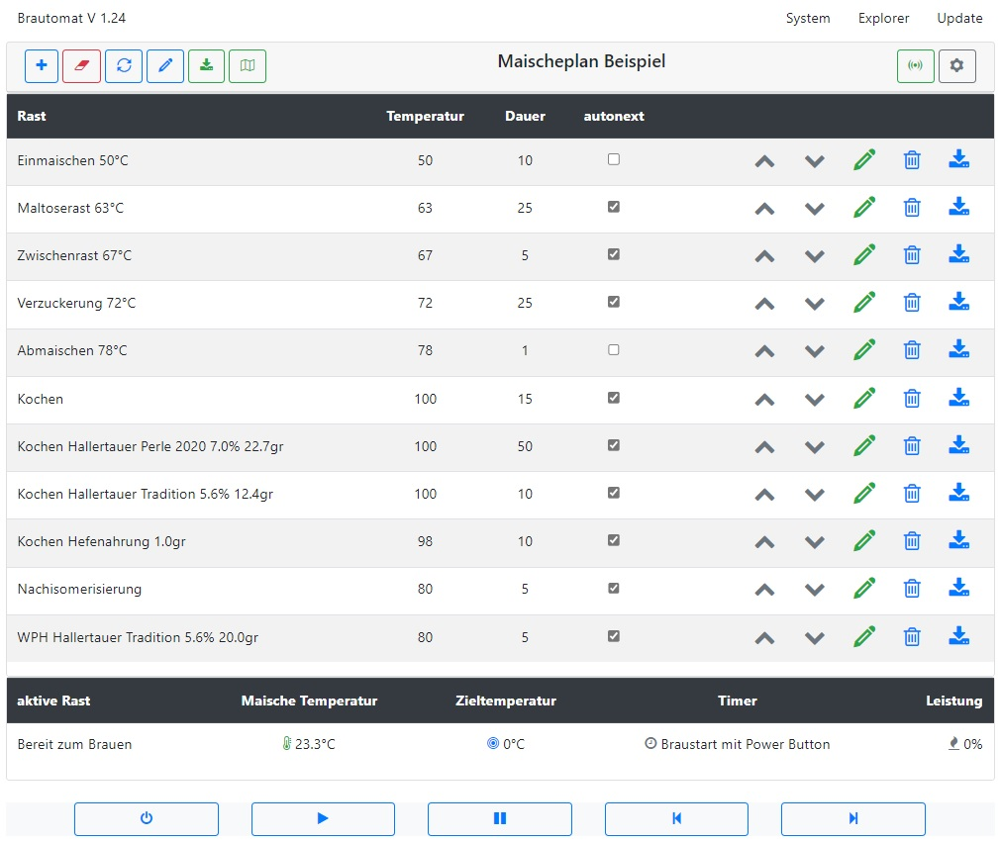
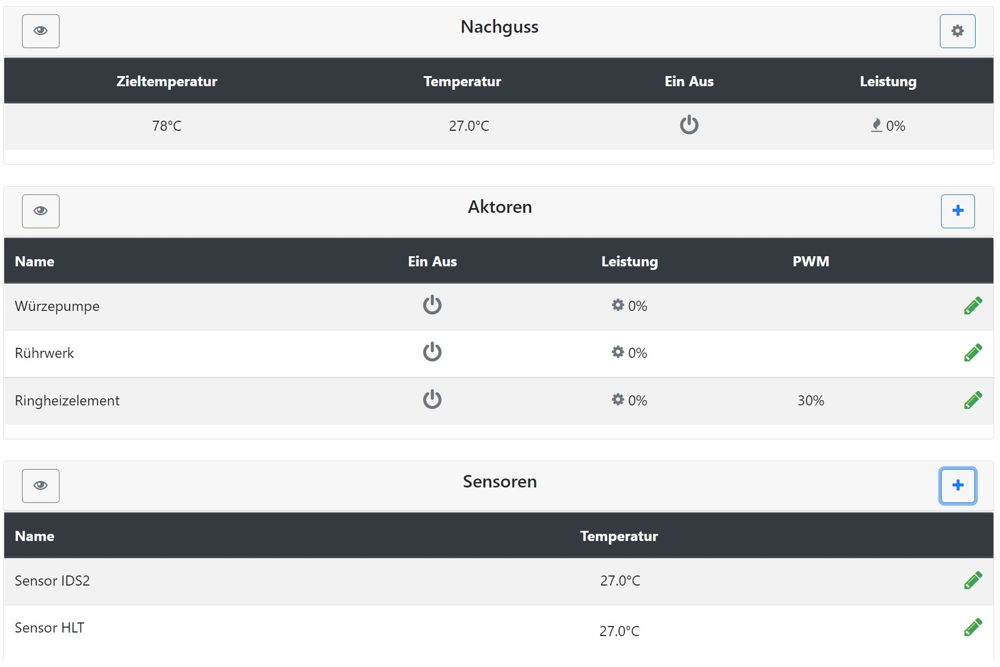

# Der Brautomat

Unterstützt werden Nextion HMI 3.5" Displays und I2C Port Erweiterung PCF8574. Integrierter AutoTune PID-Controller. Rezeptimport aus kleinerBrauhelfer2 und MMum.

## 📚 Dokumentation

Beschreibung & Anleitung: [https://innuendopi.github.io/Brautomat/](https://innuendopi.github.io/Brautomat/)

Diskussion: [https://hobbybrauer.de/forum/viewtopic.php?p=486504#p486504](https://hobbybrauer.de/forum/viewtopic.php?p=486504#p486504)

Changelog: [https://github.com/InnuendoPi/Brautomat/blob/main/CHANGELOG.md](CHANGELOG.md)

## WebInterface

Der Brautomat wird über einen WebBrowser gesteuert. Es wird ein Browser mit Unterstützung für CSS3, HTML5 und Javascript benötigt (Bootstrap 4.6) bspw:

* MS Edge ab Version 12 (getestet auf Win10, Win11 und iOS 16)
* Chrome oder Firefox Browser
* iOS ab Version 9 mit Safari
* Android mit Chrome, Bromite und DuckDuck

## Nextion HMI Touchdisplay

Hinweis: das Display ist eine optionale Erweiterung für den Brautomat. Es werden nur Nextion ITEAD HMI 3.5 Zoll Displays unterstützt.

* Braustatus Info (Infoscreen, keine Steuerung)
* MaischeSud Info (Infoscreen, keine Steuerung)
* Manuelle Steuerung Kochen (manuelle Steuerung GGM IDS2)

  

_"Boxing Bell" (info), "Short School Bell" (error), "Ding sound effect" (warning) und "Success sound effect" (success) mp3 von Free Sounds Library_ [_http://www.freesoundslibrary.com_](http://www.freesoundslibrary.com) _Licence: Attribution 4.0 International (CC BY 4.0). You are allowed to use sound effects free of charge and royalty free in your multimedia projects for commercial or non-commercial purposes._
