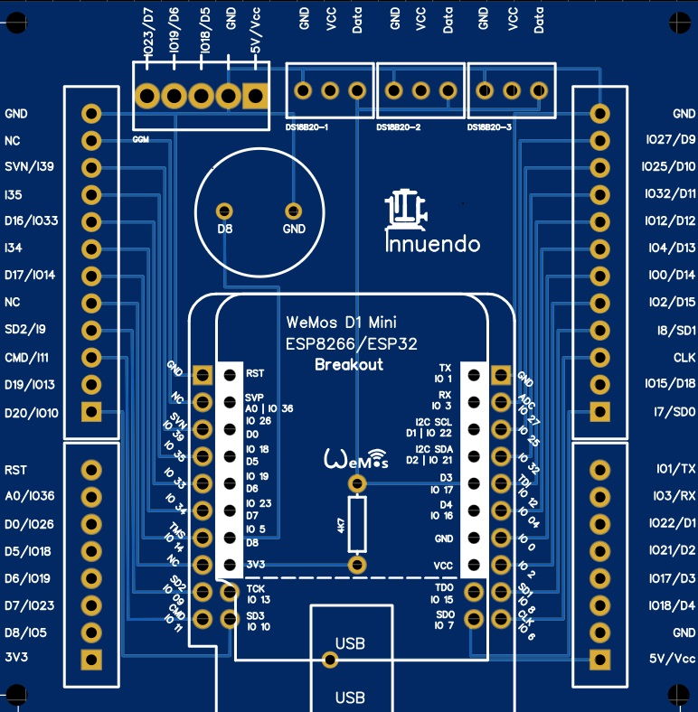
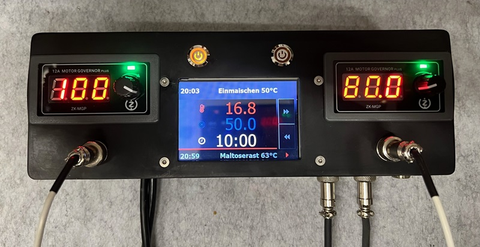
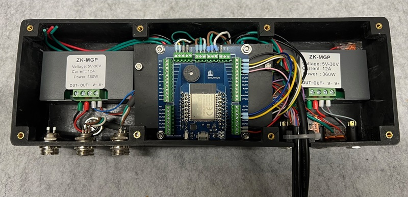

# Der Brautomat

Der Brautomat ist eine Brausteuerung für die Induktionskochfelder GGM IDS1 und IDS2 mit einem ESP8266 Wemos D1 mini. Der Brautomat bietet eine intuitiv einfach zu bedienende Steuerung.

---

## Hauptfunktionen

* Steuerung der Induktionskochfelder GGM
  * GGM IDS1
  * GGM IDS2
* integrierter PID-Controller
* PID-AutoTune
* Temperatursensoren
  * Dallas DS18B20
  * PT100 und PT1000 (MAX31865)
* Maischeplan
  * Automatisches Anfahren und halten der Rasttemperaturen
  * Würzekochen
  * Alarmierung für Hopfengaben
  * Bis zu 20 Teilschritte
* Verwaltung von Maischeplänen
* Steuerung für einen Nachguss Kessel (HLT)
* Steuerung von Aktoren, wie bspw. Rührwerk, Pumpen, etc.
* PWM für Aktoren
* Audio Alarme
  * MP3 Alarme
  * Akkustische Signale (Piezo Buzzer)
* Toasts Nachrichten
* Temperaturverlauf im Maischeprozess als Grafik (line chart)
* Rezept Import
  * kleinen Brauhelfer2
  * Maische Malz und Mehr
  * BrewFather
* Rezept Export
* Unterstützung für 3,5" HMI Touchdisplay Nextion

## 📚 Dokumentation

Beschreibung & Anleitung: [https://innuendopi.gitbook.io/brautomat32/](https://innuendopi.gitbook.io/brautomat32/)

Diskussion: [https://hobbybrauer.de/forum/viewtopic.php?p=486504#p486504](https://hobbybrauer.de/forum/viewtopic.php?p=486504#p486504)

Changelog: [https://github.com/InnuendoPi/Brautomat/blob/main/CHANGELOG.md](CHANGELOG.md)

## 📰 WebInterface

Der Brautomat wird über einen WebBrowser gesteuert.

## 💻 Nextion HMI Touchdisplay

* Kesselübersicht
* MaischeSud
* Manuelle Steuerung Kochen

  

## 🗺️ Multilingual

Der Brautomat unterstützt (nahezu) beliebig viele Sprachen. Jede Sprache hat eine eigene Sprachdatei. Die Sprachdateien im JSON Format sind im Ordner data/language hinterlegt.

_Unterstützte das Projekt und übersetze den Brautomat in eine neue Sprache bzw. korrigiere vorhandene Sprachdateien!_

## 📙 Platine 2.0

Eine Platine für den Arduino ESP Controller ist verfügbar. Die Platine bietet neben den Schraubklemmblöcken für die GPIOs auch einen separaten Anschluss für das Induktionskochfeld sowie drei Anschlüsse für Temperatursensoren. Die Gerber Datei ist im Ordner Tools hinterlegt. Die Platine 2.0 kann sowohl mit dem ESP8266, als auch mit dem ESP32 betrieben werden.

## 📗 Gehäuse

## 🔉MP3 Dateien

_Legal note: "Boxing Bell" (info), "Short School Bell" (error), "Ding sound effect" (warning) und "Success sound effect" (success) mp3 von Free Sounds Library_ [http://www.freesoundslibrary.com](http://www.freesoundslibrary.com) _Licence: Attribution 4.0 International (CC BY 4.0). You are allowed to use sound effects free of charge and royalty free in your multimedia projects for commercial or non-commercial purposes._
