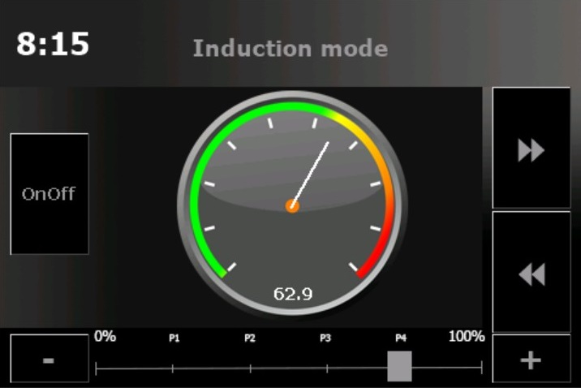

# Der Brautomat

Brausteuerung für ESP8266 Wemos D1 mini. Unterstützt werden Nextion HMI 3.5" Displays und I2C Port Erweiterung PCF8574.
Integrierter AutoTune PID-Controller. Rezeptimport aus MMum und KBH2.

Beschreibung & Anleitung: <https://innuendopi.github.io/Brautomat/>

Diskussion: <https://hobbybrauer.de/forum/viewtopic.php?p=486504#p486504>

Changelog: <https://github.com/InnuendoPi/Brautomat/blob/main/CHANGELOG.md>

## WebInterface

Der Brautomat wird über einen WebBrowser gesteuert. Es wird ein  Browser mit Unterstützung für CSS3, HTML5 und Javascript benötigt (Bootstrap 4.6), u. a.

* Edge ab Version 12 (getestet auf Win10, Win11 und iOS 16)
* Chrome ab Version 45
* iOS ab Version 9
* Android ab Version 4.4

## Nextion HMI Touchdisplay

Hinweis: das Display ist eine optionale Erweiterung für den Brautomat. Es werden nur Nextion ITEAD HMI 3.5 Zoll Displays unterstützt.

* Braustatus Info               (Infoscreen, keine Steuerung)
* MaischeSud Info               (Infoscreen, keine Steuerung)
* Manuelle Steuerung Kochen     (manuelle Steuerung der IDS (beta) )

  

*"Boxing Bell" (info), "Short School Bell" (error), "Ding Sound effect" (warning) und "Success sound effect" (success) mp3 von Free Sounds Library <http://www.freesoundslibrary.com>*
*Licence: Attribution 4.0 International (CC BY 4.0). You are allowed to use sound effects free of charge and royalty free in your multimedia projects for commercial or non-commercial purposes.*
