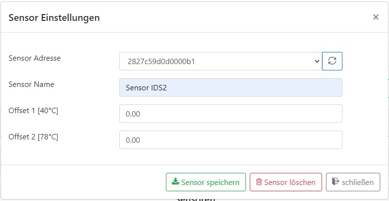
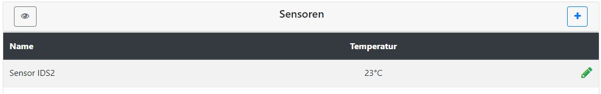
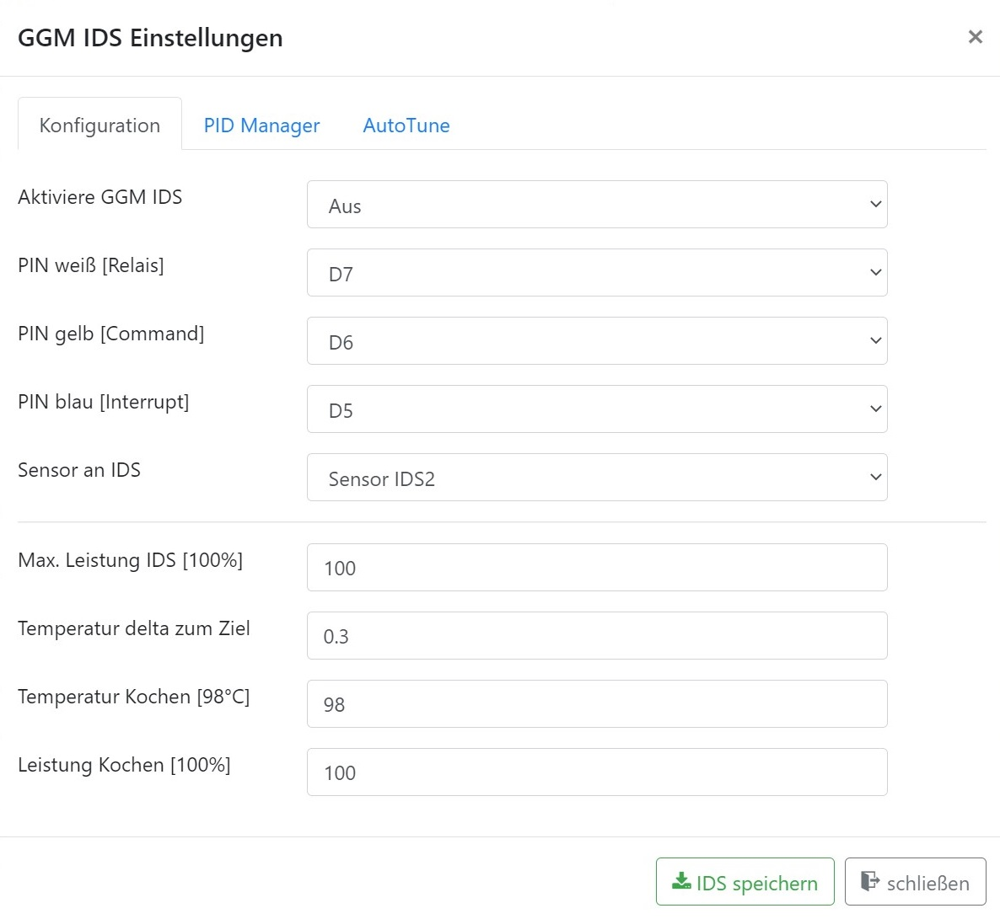
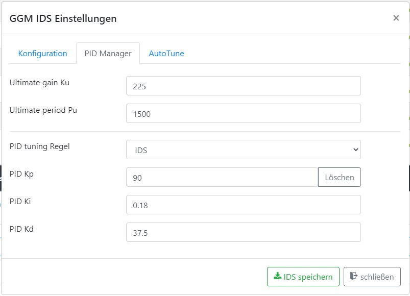
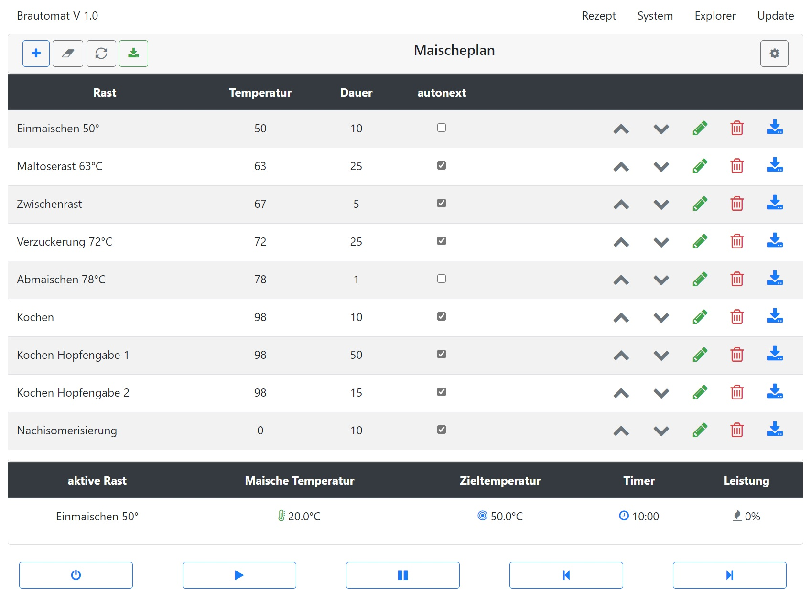
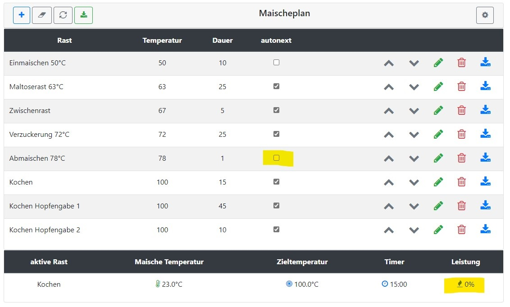
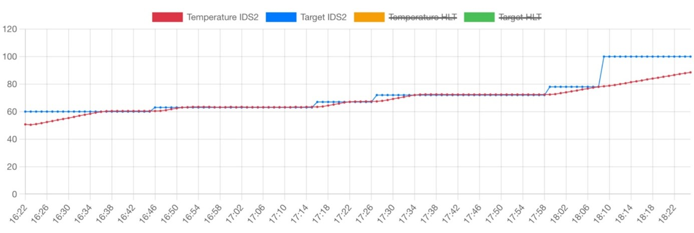
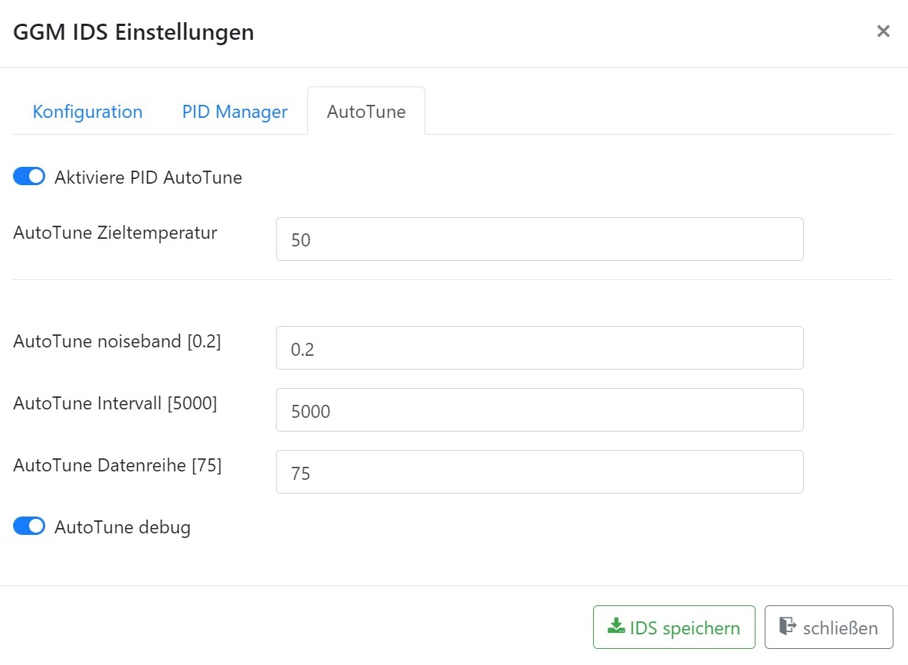
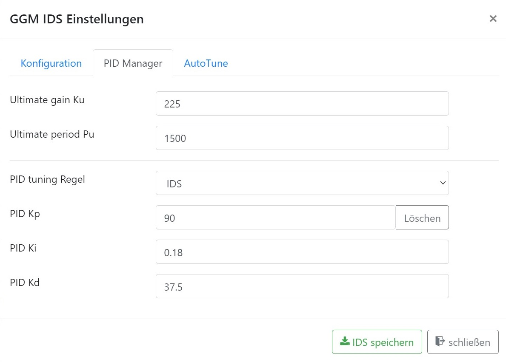

# Brautomat

Der Brautomat ist eine Brausteuerung für die Induktionskochfelder GGM IDS1 und IDS2 mit einem ESP8266 Wemos D1 mini. Der Brautomat wird im Sudhaus von Hobbybrauern eingesetzt und bietet eine intuitiv einfach zu bedienende Steuerung. Beim Maischen werden Rast-Temperaturen automatisiert angefahren und die Rast-Zeiten eingehalten. Ebenso unterstützt der Brautomat den Hobbybrauer beim Kochen der Würze und bei den Hopfengaben. Im Verfahren aufsteigende Infusion kann der Brautomat den Maischeprozess nahezu vollständig automatisieren.

***Schnelleinstieg in den Brautomaten: folgene Abschnitte lesen und Brauen***

    - Grundeinrichtung
    - Der Maischeplan
    - Steuerung Maischeplan

Die Hauptfunktionen vom Brautomat sind:

* Steuerung der Induktionskochfelder GGM IDS1 und IDS2 über einen PID-Controller
* PID AutoTune zur Ermittlung der benötigten Einstellungen
* ein Maischeplan mit bis zu 15 Teilschritten
* Steuerung für einen Nachguss Kessel (HLT) über einen PID-Controller
* Steuerung von Aktoren, wie bspw. Rührwerk, Pumpen, etc.
* einfaches PWM für Aktoren
* Temperaturverlauf im Sudhaus als Grafik (line chart)
* Maischeplan Import aus Maische Malz und mehr
* Maischeplan Import aus dem kleinen Brauhelfer2
* Maischeplan Export zur Rezept Archivierung
* Optionale Unterstützung für 3,5" HMI Touchdisplay Nextion
* Optionale Unterstützung für eine GPIO Erweiterung PCF8574

---

## Installation

Die Installation der Firmware wird über das mitgeliferte Script "Flashen.cmd" durchgeführt. Hierzu wird das Archiv Firmware.ZIP in einem beliebigen ordner entpackt. Der Wemos wird mit einem USB Kabel am PC/Notebook angeschlossen. Ein Doppelklick auf das Script Flashen.cmd startet die Installation.

Das Betriebssystem erstellt beim Anschluss vom Wemos D1 mini automatisch einen seriellen COM Port. Abhängig vom System kann das COM3, COM4 oder höher sein. Das Script Flashen.cmd ist voreingestellt auf den seriellen Anschluss COM3. Sollte der Wemos D1 Mini nicht mit COM3 verbunden sein, muss im Script Flashen.cmd in den Zeilen 6 und 8 "COM3" durch den korrekten COM Port ersetzt werden.

<pre><code>1: @ECHO OFF
2: CLS
3: SET SCRIPT_LOCATION=%~dp0
4: cd %SCRIPT_LOCATION%
5: echo erase flash
6: esptool.exe -cp COM3 -cd nodemcu -ce
7: echo Flash firmware and LittleFS
8: esptool.exe -cp COM3 -cd nodemcu -ca 0x000000 -cf Brautomat.ino.bin -ca 0x200000 -cf Brautomat.mklittlefs.bin
9: echo ESC to quit
10: pause
11: exit
</code></pre>

## Updates

Updates können im Brautomat über das Menü "Update" eingespielt werden. Eine neue Firmware kann über "WebUpdate" oder "Datei Update" eingespielt werden.
Bei einer Aktualisierung der Firmware per WebUpdate lädt die Firmware die aktuelle Version aus dem Internet aus dem github Repository. Bei der Aktualisierung per Datei Update wird die Firmware per Upload vom lokalen PC geladen. Ein USB-Kabel oder das Script aus der Installation sind nicht erforderlich.

---

## Grundeinrichtung

Der Brautomat benötigt als Mindestausstattung einen Temperatursensor vom Typ Dallas DS18B20 und ein Induktionskochfeld GGM IDS. Es werden in der folgenden Grundeinrichtung nur die benötigten Einstellungen gezeigt. Alle optionalen Einstellungen werden später erläutert.

1. Schritt: einen Temperatursensor einrichten

    Im Abschnitt Sensoren wird mit einem Klick auf das Plus Zeichen ein neuer Sensor angelegt

    

    Temperatursensoren vom Typ Dallas DS18B20 haben eine eindeutige Adresse. Über diese Adresse unterscheidet die Firmware die angeschlossenen Sensoren. Die Sensor Adresse kann aus der Auswahlliste ausgewählt. Wird kein Sensor angezeigt, kann mit dem Reload Button die Erkennung der Sensoren neu gestartet werden. Wird weiterhin kein Sensor angezeigt, ist die Kabelverbindung zu überprüfen. Als zweite Eigenschaft besitzt ein Sensor einen Namen. Über den Namen kann der Anwender die Sensoren unterscheiden. In dieser Grundkonfiguration hat der Sensor den Namen "Sensor IDS2".

    

    Die Eigenschaften Offset 1 und Offset 2 werden später erläutert. Für die Grundkonfiguration belassen wir beide Werte auf 0.00. Mit einem Klick auf "Sensor speichern" wird der Sensor angelegt und im Dashboard im Abschnitt Sensoren angezeigt:

    

2. Schritt: das Induktionskochfeld GGM IDS einrichten

    Im ersten Abschnitt "Maischeplan" wird das Induktionskochfeld über das Zahnrad angelegt

    

    Zunächst muss das Induktionskochfeld konfiguriert werden. Die erste Eigenschaft ist der IDS Typ. Es stehen IDS1 und IDS2 zur Auswahl. Es folgen drei Parameter zur Steuerung:

    * PIN weiß [Relais] - Standardeinstellung: D5
    * PIN gelb [Command] - Standardeinstellung: D6
    * PIN blau [Interrupt] - Standardeinstellung: D7

    Vorbelegt sind GPIOs (D5, D6 und D7) für das original Anschlusskabel GGM IDS (mit Anschluss an einer JST-HX Buchse).
    Als nächste Eigenschaft muss ein Temepratursensor angegeben werden, welcher dem Induktionskochfeld zugewiesen wird. In der Auswahlliste erscheinen die Sensornamen. In dieser Grundeinrichtung ist nur ein Sensor mit dem Namen "Sensor IDS2" vorhanden und wird ausgewählt.

    *Tipp*:*
    *dem Induktionskochfeld muss ein Temperatursensor fest zugewiesen werden. Der Sensorwert wird im Folgenden auch Ist-Temperatur oder aktuelle Temperatur genannt und wird im Maischeprozess immer wieder mit der Rast-Temperatur (auch Zieltemperatur) verglichen.*

    Die vier Parameter "Max. Leistung IDS", "Temperatur delta zum Ziel", "Temperatur Kochen" und "Leistung Kochen" werden später erläutert. Die Standardwerte werden übernommen.

    

    Nach der Grundkonfiguration muss der PID-Controller im Tab PID Manager eingerichtet werden. Der PID-Controller berechnet automatisch die benötigte Leistung der GGM IDS, um die Temperatur in der Maische (Ist-Temperatur) auf Rast-Temperatur zu bringen. Je besser der PID-Controller konfiguriert ist, desto genauer wird die Rast-Temperatur über die Rast-Dauer gehalten. Konfiguriert wird der PID-Controller über die zwei Parameter Ku und Pu, aus denen die die Parameter P, I und D berechnet werden. Für eine anlagenbezogene Konfiguration wird später der Prozess AutoTune im Detail erläutert. Für diese erste Grundeinrichtung werden folgende Werte für Ku und Pu eingetragen und dann die PID tuning Regel "IDS" ausgewählt:

    

    Wenn die Werte für "Ultimate gain Ku" und "Ultimate period Pu" eingetragen sind, ermittelt die Auswahl "PID tuning Regel" die drei Werte P, I und D automatisch. Eine Erläuterung aller Parameter erfolgt später.

    *Tipp:*
    *Bei einerm Kesselvolumen von 36l und einem Maischevolumen von ca. 20l sind folgende Startparameter gut geeignet:*

    <pre><code>Ultimate gain Ku:     182
   Ultimate period Pu:   2245</code></pre>

    *Bei einerm Kesselvolumen von 70l und einem Maischevolumen von über 40l sind folgende Startparameter gut geeignet:*

    <pre><code>Ultimate gain Ku:     225
   Ultimate period Pu:   1500</code></pre>

    Mit dem Speichern der Konfiguration ist die Grundkonfiguration bereits abgeschlossen. Mit einem Temperatursensor und einer GGM IDS kann nun gebraut werden. Zum Brauen ist ein Maischeplan und eine Steuerung erforderlich.

---

## Der Maischeplan

Der Brautomat arbeiten nach einem Maischeplan. Die folgende Beschreibung hat nicht das zugrunde liegende Rezept als Inhalt, sondern das Vorgehen beim Maischen mit dem Brautomat. Der Maischeplan hat eine Tabellenform. Diese Tabelle wird beim Maischen von oben nach unten abgearbeitet. In diesem Beispiel ist die Zeile "Einmaischen 50°C" der erste Maische-Schritt und "Nachisomerisierung" der letzte Maische-Schritt. Elementar wichtig im Maischeplan ist die Funktion *autonext*. Die Funktion wird im Detail erläutert.

Zur Orientierung wird zunächst der Aufbau der Tabellenzeilen beschrieben. Jede Zeile der Tabelle hat diese Spalten:

* Die Spalte "Rast" zeigt einen Namen für diesen Maische-Schritt
* Die Spalte "Temperatur" zeigt die Rast-Temperatur (auch Ziel- oder Soll-Temperatur genannt)
* Die Spalte "Dauer" ist die Rast-Dauer (Timer), wie lange der Brautomat die Rast-Temperatur halten soll
* Die Spalte "autonext" besagt, ob automatisch zum nächsten Schritt gwechselt wird, wenn die Rast-Dauer (Timer) erfüllt ist

Nach diesen vier Angaben zum Maische-Schritt hat jede Zeile Buttons zum Editieren mit den folgenden Funktionen: (von links nach rechts)

* verschiebe diese Zeile eine Position nach oben
* verschiebe diese Zeile eine Position nach unten
* editiere diese Zeile
* lösche diese Zeile
* speichere die Zeile in die Tabelle

Die Funktion von "autonext" wird an einem Beispiel erläutert:

der zweite Schritt im Maischeplan mit dem Namen *Maltoserast 63°C* hat als Rast-Temperatur 63°C und eine Rast-Dauer von 25 Minuten. Der Brautmoat steuert in diesem Schritt das Induktionskochfeld zunächst auf 63°C. Sobald diese 63°C erreicht sind, startet der Brautomat den Timer. Ein Timer ist eine Stoppuhr. Wenn diese Stoppuhr die Rast-Dauer von 25 Minuten erreicht hat, überprüft der Brautomat die Eigenschaft *autonext*. Wenn das Häkchen gesetzt ist (autonext aktiviert), springt der Brautomat automatisch zum nächsten Schritt im Maischeplan. In diesem Bespiel zum Schritt *Zwischenrast*. Die Zwischenrast hat eine Rasttemperatur von 67°C. Automatisch erhöht der Brautomat die Leistung vom Induktionskochfeld, um die Rast-Temperatur zu erreichen. Der Masicheprozess verläuft bei aktiviertem autonext automatisch.

Die Eigenschaft *autonext* im fünften Schritt *Abmaischen 78°C* ist nicht aktiviert. Wenn der Brautomat auf ein deaktivertes autonext trifft, beendet der Brautomat die aktuelle Rast nach Ablauf der Rast-Dauer und setzt die Leistung vom Induktionskochfeld auf 0% (aus). In diesem Status wird der "Play Button" rot angezeigt. Zum Fortsetzen des Brauvorgangs muss auf den Play Button geklickt werden:

Als aktive Rast wird auf diesem Bild "Kochen" angezeigt. Die aktuelle Leistung wird mit 0% angezeigt und der Play Button ist rot. Dieser Status ist genau dann erreicht, wenn die Rast *Abmaischen 78°C* beendet ist und der Brautomat auf das Fortsetzen durch eine Aktivität durch den Anwender wartet. Der Masicheprozess verläuft bei deaktiviertem autonext manuell.

Im Bild Maischeplan sind das Einmaischen und das Abmaischen mit deaktiviertem autonext dargestellt. Das Einmaischen ist beendet, wenn das Schrot im Hauptgusswasser. Wenn nun der Button Play geklickt wird, startet der Maischeprozess. Das Abmaischen ist meist nach sehr kurzer Zeit (im Bild 1 Minute) beendet. Es folgt die Läuterruhe und das Läutern. Hier entscheidet der Brauer, wann das Aufheizen zum Kochen beginnen soll.

*Tipp: bei deaktiviertem autonext am Rastende wird die GGM IDS abgeschaltet. Mit dem Pause Button wird die Rast-Zeit angehalten (Timer). Die GGM IDS bleibt eingeschaltet und hält die aktuelle Temperatur.*

Wenn die Funktion *autonext* aktiviert ist, überprüft der Brautomat forlaufend die aktuelle Ist-Temperatur mit der Rast-Temperatur. Die Eigenschaft "Temperatur delta zum Ziel" gibt an, wie viel Grad Unterschied vorhanden sein darf, um den nächsten Maische-Schritt zu starten. In dem Beispiel Maltoserast 63°C und bei einem "Temperatur delta zum Ziel" von 0.3°C würde der Maischeschritt ab einer Ist-Temperatur von 62.7°C gestartet (bzw. ab 63.3°C).

*Tipp: mit "Temperatur delta zum Ziel" wird ein Temperaturbereich um die Rast-Temperatur angegeben, innerhalb dem der Timer einer Rast gestartet wird.*

Eine Sonderfunktion hat die Rast-Temperatur 0°C bei aktivertem autonext: wenn die Rast-Temperatur auf 0°C gesetzt und autonext aktiviert ist, wird der nachfolgende Maischeschritt ohne Temperaturüberprüfung automatisch gestartet. Diese Sonderfunktion kann bspw. nach dem Kochen der Würze nützlich sein, wenn einer Timer für die Nachisomerisierung gestartet und die GGM IDS ausgeschaltet werden soll.

Durch die Tabellenform ist das Grundprinzip vom Brautomat die aufsteigende Infusion. Das schließt Varianten wie bspw. das Earlsche Kochmaischverfahren ein. Mit Hilfe der Eigenschaft "autonext" können auch andere Brauverfahren umgesetzt werden. Es gilt aber zu beachten, dass der Brautomat bei anderen Brauverfahren nur mit "halber Automatik" unterstützen kann. Ein auslösender Trigger für eine Aktion wie bspw. das Ziehen von Teilmaischen, muss durch den Anwender manuell erfolgen. Eine Rast mit einer Minute Dauer und deaktiviertem autonext kann ein Auslöser sein. Hat ein Schritt im Maischeplan die Eigenschaft "autonext" deaktivert und ist eine Aktion durch den Anwender erfolgt, dann kann mittels dem Play Button der nächste Schritt gestartet werden.

*Tipp: Hopfengaben - Im Bild Maischeplan ist das Würzekochen unterteilt in "Kochen", "Kochen Hopfengabe 1" und "Kochen Hopfengabe 2". Die Unterteilung kann passend zur Anzahl der Hopfengaben vorgenommen werden. Wenn ein Buzzer angeschlossen ist, ertönt mit jedem Schritt ein Signalton.*

## Steuerung Maischeplan

Direkt unterhalb vom Maischeplan befindet sich die Steuerung. Mithilfe der 5 Buttons Power, Play, Pause Backward und Forward wird der Maischeprozess gesteuert.

### Der Power Button

Über den Power Button wird der Maischeprozess ein- bzw. ausgeschaltet. Sobald AutoTune in den Einstellungen der GGM IDS oder im Nachguss aktiviert ist, wird der AutoTune Prozess über den Power Button gestartet bzw. gestoppt.

*Tipp: Wenn der Maischeprozess gestartet ist, sind die Funktionen zum editieren des Maischeplans deaktiviert. Wird der Maischeprozess pausiert, kann der Maischeplan während des Paischeprozesses verändert werden.*

### Der Play Button

Der Play Button hat im Maischeprozess zwei Funktionen:

* setze den Maischeprozess mit der nächsten Rast fort und starte den Rast-Timer. Die Funktionen "mit der nächsten Rast den Maischeprozess fortsetzen" wurde mit der Beschreibung "autonext" im Maischeplan erläutert. Der Play Button wird rot angezeigt.

* Die zweite Funktion "starte sofort den Rast-Timer" startet unabhängig von der IST-Temperatur den Rast-Timer. Ein Anwendungsfall ist, wenn der Maischeprozess nicht nach Plan verläuft und der Brauer eingreifen muss. Beim Schritt Kochen der Würze kann der Rast-Timer gestartet werden, wenn augenscheinlich das wallend Kochen beginnt. Der Play Button wird blau angezeigt.

### Der Pause Button

Mit dem Pause Button wird der Rast-Timer im Maischeprozess angehalten. Der Pause Button wird dann rot angezeigt. Der Maischeprozess wird mit einem Klick auf den Pause Button fortgesetzt. Wichtig: Während einer Pause wird die aktuelle Ist-Temperatur gehalten, d. h. das Induktionskochfeld bleibt eingeschaltet. Hier unterscheiden sich "Pause" und "autonext": bei deaktiviertem autonext wird die GGM IDS ausgeschaltet.

### Der Backward Button

Mit dem Backward Button wird zum vorherigem Schritt im Maischeplan gesprungen. War der Maischeprozess pausiert, wird der Rast-Timer der aktuellen Rast zurückgesetzt und neu gestartet.

### Der Forward Button

Mit dem Forward Button wird zum nächsten Schritt im Maischeplan gesprungen oder falls es der letzte Schritt im Plan war der Maischeprozess beendet.

---

## Der AutoTune Prozess

AutoTune hat die wichtige Aufgabe, passende Parameter für die Brauanlage zu ermitteln, damit der Maischeprozess so genau wie möglich durchgeführt wird. Im Fokus stehen die IST- und die zugehörigen SOLL-Temperaturen. In der Praxis bedeutet dies, dass ein Über- und Unterschwingen vermieden werden soll.

Die folgende Beschreibung der PID-Werte ist lediglich eine Hilfe zur Verwendung der Firmware und kann auch übersprungen werden. Der AutoTune Prozess wird ab "Der AutoTune Prozess: Schritt für Schritt" beschrieben.
Der PID-Controller steuert die Leistung der Induktonsplatte. Es ist wichtig, geeignete P, I und D Werte zu ermitteln. Dabei sind die PID Werte je Brauanlage und Umgebung individuell. AutoTune ist ein Prozess, der bei der Ermittlung geeigneter Werte unterstützt.
Die benötigte Leistung der Induktionsplatte, um von der Ist-Temperatur zur Zieltemperatur zu gelangen, wird aus der Summe der drei Werte berechnet:
Erforderliche Leistung = P + I + D

### Der P-Wert

Dieser Parameter wirkt auf der Basis Unterschied zwischen Ist und Soll. Je größer der Unterschied zwischen der Ist- und der Zieltemperatur ist, desto stärker heizt die Induktionsplatte mit dem P-Anteil. Ist die Zieltemperatur erreicht oder überschritten, ist der P-Anteil gleich 0. Ein reiner P-Regler kann daher nie die Zieltemperatur erreichen, weil beim Erreichen der Zieltemperatur P = 0 ist und somit gar nicht mehr geheizt wird. Ein sehr hoher P-Wert bewirkt ein starkes Über- bzw. Unterschwingen.

### Der I-Wert

Der I-Wert wird, während die Induktionsplatte heizt, bei null beginnend fortlaufend größer. Je länger die Induktionsplatte von der Ist-Temperatur zur Zieltemperatur benötigt, desto größer wird der I-Wert. Zusammen mit dem P-Wert ergibt sich nun folgende Addition:
Der P-Wert wird bei Annäherung an die Zieltemperatur kleiner und der I-Wert größer. Nur über den I-Wert wird die Zieltemperatur erreicht. Der I-Wert wird oberhalb der Zieltemperatur wieder kleiner. Der I-Wert erzeugt ein Überschwingen.

### Der D-Wert

Der D-Wert ist ein Dämpfer, der die Schwingungen der ersten beiden Anteile mindert. Ein zu starker D-Anteil verlangsamt das Auf- und Nachheizen der Induktionsplatte. Dieser Wert kann auch null sein.

### Der AutoTune Prozess: Schritt für Schritt

Das praktische Vorgehen AutoTune schaut wie folgt aus:

1. Befülle Deinen Kessel mit einer typischen Menge Wasser

    a. Eine typische Menge entspricht dem Hauptguss + Schüttung

    Beispiel: 20l Hauptguss und 5kg Schüttung ergibt eine typische Menge von 25l

    b. Schalte das Rührwerk ein

2. Setze eine AutoTune Zieltemperatur. Die Zieltemperatur sollte 20°C oder mehr über der aktuellen Ist-Temperatur liegen.
3. Aktiviere „PID AutoTune“
4. Aktiviere „AutoTune debug“
5. Speichere diese Einstellung ab (IDS speichern)
6. Mit einem Klick auf den grünen Power Button wird "AutoTune IDS" gestartet.

Der AutoTune Prozess dauert je nach Umgebung bis zu 90min. Der meiste Zeitbedarf entsteht während den Abkühlphasen. Je besser ein Braukessel wärmegedämmt ist, desto länger dauert der AutoTune Prozess. Der aktuelle Status ist in der Spalte „in progress 0/5“ sichtbar. Die erste Zahl ist der aktuelle Schritt und die zweite Zahl die Anzahl der AutoTune-Schritte. Treten Fehler auf, erscheint an dieser Stelle „in progress 6/5“ und höher. Der AutoTune Prozess prüft die gefundenen Messerte. Ist ein Messwert fehlerhaft, wird die Messung wiederholt. Es werden maximal 20 Wiederholungen durchgeführt.

Das AutoTune Ergebnis wird in den Einstellung der GGM IDS (Zahnrad) im Tab PID-Manager dargestellt:

Das Ergebnis von AutoTune sind die Werte von "Ultimate gain Ku" und "Ultimate period Pu". Aus diesen zwei Parametern werden P, I und D berechnet. Zur Berechnung der PID-Werte stehen diverse Regeln zur Verfügung. Der Brautomat verwendet eine Tuning-Regel, die für das Brauen (eigentlich für das Erhitzen von Flüssigkeiten) optimiert ist und u.a. auch in CraftBeerPi PIDBoil eingestezt wird.

*Tipp: Nach dem AutoTune Prozess sollte die Konfiguration mittels Backup gesichert werden.*

Wenn der AutoTune Prozess beendet ist und wurde "AutoTune debug" aktiviert, kann über den Explorer das Protokoll "autotune_log.txt" eingesehen werden. Diese Datei sollte nach AutoTune kontrolliert werden. Entscheidend sind die letzten Zeilen in der Protokoll Datei:

`0min0sec: convergence criterion ok: 0.05/0.05`

`0min0sec: Peaks: 1: 61.250 2: 59.750 3: 61.500 4: 59.750`

`0min0sec: Time: 1: 3520743 2: 3385743 3: 2805697 4: 2705697`

`0min0sec: Ultimate gain Ku: xxx`

`0min0sec: Ultimate period Pu: xxx`

`0min0sec: k/min rate Mu: xxx`

`14:12:38 PID AutoTune finished`

1. "convergence criterion ok:" (alle Zahlen hinter diesem Text sind rein informativ)
2. Peaks: 1: (61.250) und 3: (61.500) müssen über der Zieltemperatur (60.0) sein
3. Peaks: 2: (59.750) und 4: (59.750) müssen unter der Zieltemperatur (60.0) sein

Wenn diese drei Bedingungen erfüllt sind, war der AutoTune Prozess erfolgreich.

In der Datei "idsAutoTune.txt" wird das AutoTune Ergebnis im JSON Format abgespeichert. Beide Dateien sind rein informativ und werden für den Betrieb nicht benötigt.

---

## Die Sensoren

### Kalibrierung Temperatursensor

Sensoren vom Typ Dallas DS18B20 haben teilweise Abweichung von der tatsächlichen Temperatur. Mithilfe einer 2-Punkte Kalibrierung kann diese Abweichung korrigiert werden. Zur Kalibrierung der Sensoren wird ein geeichtes Thermometer benötigt. Der Braukessel wird mit einer typischen Menge Wasser befüllt und auf 40°C erhitzt. Der Unterschied zwischen dem Sensorwert und dem geeichten Thermometer wird im Parameter "Offset 1 [40°C]" eingetragen. Dieser Vorgang wird bei 78°C wiederholt und der Unterschied wird im Parameter "Offset 2 [78°C]" eiongetragen. Alle Sensormesswerten werden künfig anhand dieser Korrektur ausgegeben.

---

## Der Nachguss

Der Brautomat bietet optional die Möglichkeit, einen "Kessel" für den Nachguss zu konfigurieren. Der Nachguss kann bspw. ein einfacher Wasserkocher sein. Die Konfiguration wird in fast identischer Weise wie die GGM IDS durchgeführt. Im Gegensatz zur GGM IDS Konfiguration steht nur ein GPIO zur Verfügung: es handelt sich um ein Temperaturregler für eine Relais Schaltung (i. S. v. Ein oder Aus).

Ein neuer Konfigurationsparameter "GPIO invertieren" wird bei der Nachguss und auch bei der Konfigruation von Aktoren angeboten. GPIOs können beim Einschalten des Wemos per Standardeinstellung auf HIGH stehen. HIGH bedeteutet "es fließt Strom". Dementsprechend bedeutet LOW es fließt kein Strom. Die Werkseinstellung vom Wemos und das allgemeine Verständnis von einem Ein-Aus Schalter wäre demnach, dass mit der Stromzufuhr Wemos alle GPIOS (Schalter) auf Eingeschaltet stehen. GPIO invertieren dreht die Werkseinstellung um.

*Tipp:*
*Wenn Aktoren nach der Konfigruation und Stromzufuhr eingeschaltet starten, muss die Eigenschaft GPIO invertieren aktiviert werden*

---

## Die Aktoren

Aktoren wie bspw. Rührwerk, Pumpen oder Ringheizelemente werden mit einem Namen und einem GPIO (Schalter) konfiguriert. GPIO invertieren wurde im Abschnitt Nachguss erläutert. EIne neue Eigenschaft ist PWM oder Pulsweitenmodulation. PWM im Brautomat ist ein takten. Genauer beschreiben: das takten von Ein und Ausschalten oder Storm fließt und Strom fließt nicht. Die Eingabe ist in Prozent. Permanent eingeschaltet sind 100%. Bei einem Wasserkocher wäre dies sinngemäß dauerhaft maximale Leistung. Ein PWM von 50% wäre 50:50 Strom fließt und Strom fließt nicht. Bei einem Wasserkocher wäre dies sinngemäß halbe Leistung. Nicht alle Aktoren sind für PWM geeignet. Sehr gut geeignet ist ein Ringheizelement (220V AC) mit einer PWM Taktung über ein SSR. Gleichstrom Aktoren lassen sich besser und einfacher mit PWM Modulen regeln.

---

## Alle GGM IDS Parameter im Überblick

### Max. Leistung IDS

Dieser Parameter beschreibt die maximale Ausgangsleistung der GGM IDS. Der Standardwert ist 100%. Dieser Parameter kommt zum Einsatz, wenn ein kleiner Kessel mit bspw. 20l Volumen auf der GGM IDS genutzt wird. Durch Reduzierung der Leistung der IDS kann ein zu schnelles Aufheizen und ein Überkochen vermieden werden. Die Parameter "Max. Leistung IDS" und "Leistung kochen" sollten in Umgebungen mit kleineren Braukesseln zusammen betrachtet werden.

### Temperatur delta zum Ziel

Dieser Parameter beschreibt, ab welcher Differenz zur Rasttemperatur der Timer einer Rast starten soll. Der Standardwert ist 0.3°C.
Im Maischeprozess ermöglicht der PID Controller eine sehr genaue Temperatursteuerung. Eine Rasttemperatur wird mit +-0.2°C genau erreicht, indem der PID Controller die Energiezufuhr kurz vor Erreichen der Rasttemperatur kontrolliert reduziert. Würde die Energiezufuhr erst mit Erreichen der Rasttemperatur reduziert werden, wäre ein deutliches Überschwingen um mehr als 1°C unvermeidlich. Die Reduzierung der Energiezufuhr hat als Nebeneffekt, dass der letzte Schritt zum Erreichen der Rasttemperatur länger dauert. Genau an dieser Stelle kommt der Parameter "delta zum Ziel" ins Spiel: soll bspw. eine Rasttemperatur von 63°C erreicht werden und ist die aktuelle Temperatur 62.7°C, dann würde mit einem Temperatur delta zum Ziel von 0.3°C der Rasttimer starten. Bezogen auf die individuelle Brauanlage kann mit delta zum Ziel eine ungewollte Verlängerung der Rastzeit vermieden werden. Zu beachten gilt auch, dass die IST-Temperatur mit einer Genauigkeit von 0.125°C ermittelt wird.

### Temperatur Kochen

Dieser Parameter beschreibt die Temperatur, ab der der PID Controller das Kochen der Würze erkennen soll. Der Standardwert ist 95°C. Dieser Parameter beschreibt NICHT, ab welcher Temperatur die Würze beginnt zu kochen. Dieser Parameter beschreibt die Temperatur, ab der der Brautomat den PID Controller deaktiviert und mit einer vorgegebenen Leistung "Leistung Kochen" das Induktionskochfeld steuert.
Anders als bei den Rast-Temperaturen ist beim Kochen nicht das genaue erreichen und halten der Temperatur das Ziel, sondern das wallend Kochen. Anstatt also die Leistung zu reduzieren, wird beim Kochen das Induktionskochfeld mit einer gleichbleibenden Leistng betrieben.  

*Tipp: Bei Ist-Temperaturen über dem Wert Temperatur Kochen und über der Rast-Temepratur wird der Parameter "Temperatur Delta zum Ziel" nicht beachtet.*

### Leistung Kochen

Dieser Parameter beschreibt die Ausgangsleistung der IDS ab der Temperatur Kochen. Der Standardwert ist 100%. Mit dem Parameter "Temperatur kochen" ist eine Temperatur festgelegt worden, ab der der PID Controller deaktiviert wird. Mit dem Parameter "Leistung kochen" wird nun die feste Ausgangsleistung der IDS ab der Temperatur Kochen vorgegeben. Wird ein Braukessel mit einem Volumen über 35l oder mehr eingesetzt, ist der Standardwert 100% eine passende Wahl. In Brauküchen mit kleinen Kesseln kann 100% Energiezufuhr zum Kochen ein Überkochen bewirken. In diesem Fall kann die maximale Energiezufuhr mit diesem Parameter auf bspw. 75% reduziert werden.

Diese vier Parameter sind je Brauanlage individuell einzustellen. Die Parameter können während eines Maischeprozesses geändert werden. Mit einem Testlauf mit einer typischen Menge Wasser können die Paramter vor einem Brautag leicht ermittelt werden.

### AutoTune noiseband

Dieser Parameter wird für die Erkennung von Extremwerten (Max, Min) verwendet. AutoTune noiseband gibt an, welche Mindeständeurng zum vorherigen Messwert vorhanden sein muss, um einen neuen Extremalwert zu erkennen. Der Standardwert für die GGM IDS beträgt 0.2. Für einen Nachguss Kocher über ein Relais oder SSR beträgt der Standardwert 0.3. Es gilt zu beachten, dass die Messgenauigkeit bei 0.125 liegt.

### PID Intervall

Dieser Parameter gibt an, in welchem zeitlichen Abstand eine Berechnung der benötigten Leistung ermittelt werden. Der Standardwert ist 5000ms. Das Intervall wird zur PID Berechnung und im AutoTune eingesetzt. In Brauküchen mit kleinem Volumen ist ein kleineres Intervall ggfs. vorteilhaft. Je kleiner das Intervall, desto häufiger werden Sensoren abgefragt und PID Werte berechnet. Dies führt zur einer höheren Auslastung des Wemos.

### AutoTune Datenreihe

Dieser Parameter gibt an, wie viele Messwerte für die Ermittlung von Extremalwerten betrachtet werden sollen. Der Standardwert für eine GGM IDS beträgt 75 Messwerte, bei einem Nachguiss Kocher beträgt der Standardwert 50. Zu beachten gilt, dass maximal 100 Messwerte konfiguriert werden können. Bei sehr gut wärmeisolierten Braukesseln (bspw. mit Armaflex) kann eine Erhöhung auf 100 Messwerte in der Datenreihe die Erkennung von Extremalwerten in der Abkühlphase vom AutoTune Prozess verbessern.

---

## Alle System Parameter im Überblick

### Aktiviere Alarm-Buzzer

Mit diesem parameter kann ein Piezo Buzzer aktiviert werden. Zu beachten gilt, dass der Buzzer an GPIO D8 angeschlossen sein muss. Buzzer Alarme unterstützen den Maischeprozess durch Signaltöne.

### Aktiviere Info Nachrichten Toasts

Toasts sind kleine Push Nachrichten. Die Nachrichten erscheinen als Kachel unten rechts im Browser. Nach ca. 10sek verschwinden die Toasts wieder. Es gibt Toast Nachrichten zum Maischeprozess und Toast Nachrichten zu Systemfehler. Dazu passend hat die Eigenschaft Toasts 3 Optionen: Aus, Ein und Fehler. Die Auswahl "Aus" schaltet Toast Nachrichten ab. Die Option "Ein" sendet alle Toasts Nachrichten. Die Option "Fehler" sendet nur Toast Nachrichten bei Systemfehler, aber keine Nachrichten zum Maischeprozess.

Toasts unterstützen eine Audio Ausgabe. So werden Toasts im Maischeprozess nicht nur zu einer visuelle, sondern auch einer akkustischen Erinnerung. Die Firmware beinhaltet die Audio Dateien info.mp3, success.mp3, warning.mp3 und error.mp3. Die Audio Dateien (mp3) können ausgetauscht werden. Lediglich die Benennung muss gleich bleiben. Im Browser sollte Autoplay Audio für die IP-Adresse des Brautomaten erlaubt sein (nicht auf iOS Systemen verfügbar).

Toast Nachrichten können systembedingt wenige Sekunden zeitverzögert zugestellt werden. Jeder Browser erhält seine eigenen Toast Nachrichten. Zwei Geräte mit geöffnetem Browser auf den Brautomat erhalten (systembedingt) die gleiche Toast Nachricht bis zu 2 Sekunden zeitversetzt. Voreingestellt werden Toasts spätestens nach 60 Sekunden gelöscht. Innerhalb dieser 60 Sekunden überscheiben neue Toasts ältere Nachrichten (keine Stapelverarbeitung).

*Toasts in der Praxis*
*In der Brauküche wird meist ein Gerät und ein Browser mit dem Brautomat verwendet. Toasts mit mp3 Audio bieten eine einfache und laute akkustische Aufforderung zum Handeln. Deshalb ist es vorteilhaft, wenn die Enegerieoptionen beim Brauen deaktiviert werden und der Browser während des Brauens durchgehend aktiv ist. Wenn die Brauküche verlassen wird, sind Toasts auf einem Smartphone oder Tablet eine optischer und akkustischer Begleiter. Auch mobile Geräten müssen durchgehend aktiv sein. Toasts melden sich auf allen verbundenen Browsern. Anders gesagt: jeder Browser merkt sich, welche Toast ID bereits angezeigt wurde. Es ist richtig und gewollt, wenn ein PC Browser und ein Smartphone die gleiche Toast Nachricht minimal zeitversetzt anzeigen*

### Aktviere Porterweiterung PCF8574

Mit diesem Parameter kann eine 8-Port GPIO Erweiterung am ESP8266 betrieben werden. Zu beachten gilt, dass die Port Erweiterung an D5, D6 angeschlossen werden muss. Der Interrupt Modus wird nciht unterstützt.

### Aktiviere Touchdisplay

Mit diesem Parameter kann ein Nextion HMI 3.5 Zoll Display betrieben werden. Der Brautomat bietet drei Ansichten

    - die Kessel Seite:     auf dieser Ansicht werden IDS und Nachguss mit Ist- und Zieltemperaturen dargestellt.
                            Die aktuelle und die nächste Rast werden mit Dauer angezeigt.
                            Die Länge vom rote Balken unter der Ansicht IDS und Nachguss zeigt die erledigte Rastdauer an.  

    - die Brauen Seite:     auf dieser Ansicht wird das Induktionskochfeld dargestellt.
                            Es wird nur die aktuelle Rast mit Dauer im Kopf angezeigt.
                            Die Länge roter Balken unter den Temperaturen den Fortschrit der aktuellen Rast an.

    - die Kochen Seite:     auf dieser Ansicht ist für die manuelle Steuerung vom Induktionskochfeld
                            Im manuellen Betrieb stehen 6 Powerstufen zur Verfügung: 0, 20, 40, 60, 80 und 100% Leistung
                            Der manuelle Betrieb ist nur für die GGM IDS2 geeignet. (IDS1 nicht getestet!) 

Ein Display ist optional. Der Brautomat unterstützt ausschließlich Nextion HMI 3.5 Zoll Touchdisplays (Basic und Discovery Series).

Das Display wird mit einer SD Karte konfiguriert. Die zum Display passende TFT Datei aus dem Ordner Info wird auf eine SD Karte kopiert und in das Display eingesteckt. Sobald das Display eingeschaltet wird, startet die Konfiguration. Der Vorgang dauert etwa eine Minute. Im Display steht der Fortschritt. Sobald die Konfiguration aufgespielt ist, wird das Display abgeschaltet und die SD Karte entfernt. Das Display ist nun einsatzbereit.

Zu beachten gilt, dass SDA, SCL an den PINs D1, D2 betrieben werden müssen.

---

## Beschreibung aller Buttons

Der Maischeplan verfügt über Buttons zum Editieren, erweitern oder Löschen der Tabelle. Diese sind eher selbsterklärend.

### Der grüne Speichern Button

Mit dem günen Button Tabelle speichern in der Kopfzeile der Tabelle Maischeplan wird der Inhalt der Tabelle in eine Datei (JSON) abgespeichert.

### Der blaue Speichern Button

Mit dem blauen Button Zeile speichern wird die Ändeurng der aktuellen Zeile in die Tabelle übernommen.

### Der Aktualisiere Maischeplan Button

Mit dieser Funktion wird die Tabelle neu aus der Datei eingelesen. Zu beachten gilt, dass alle nicht gespeicherten Änderungen ohne Rückfrage verworfen werden.

### Der Löschen Button

Mit dem Löschen Button wird die gesamte Tabelle geleert. Zu beachten gilt, dass erst mit Klick auf Tabelle Speichern die Änderung übernommen wird.

### Der + Button

Mit dem Plus-Button wird eine neue Rast hinzugefügt. Zu beachten gilt, dass die neue Zeile in der Tabelle mit Klick auf das blaue Speichern-Symbol in der Tabellenzeile übernommen werden muss und abschließend mit einem Klick auf das grüne Speichern-Symbol die Tabelle gespeichert wird.

### Der Graph Button

Mit dem Graph Button kann die visuelle Darstellung vom Temperaturverlauf ein- bzw. ausgeblendet werden. Zusätzlich können einzelne Graphen durch Klick auf den Graphnamen ein- und ausgeblendet werden.

### Der Auge Button

Mit dem Auge-Button können Teile der Webseite sichtbar bzw. unsichtbar geschaltet werden. Wen bspw. keine Aktoren eingesetzt werden, kann die Tabelle Aktoren ausgeblendet werden.

*Tipp: alle nicht benötigten Elemente auf der Webseite ausgeblenden und anschließend die Systemkonfiguration öffnen und auf Speichern klicken. Damit übernimmt der Brautomat die Einstellung und blendet beim nächsten Start alle markierten Elemente aus.*

---

## Die Platine

Die Platine zum Projekt Brautomat macht den Aufbau und die Verwendung sehr einfach. Dabei ist die Platine völlig unabhängig vom Projekt Brautomat. Mit einem ESP8266 Wemos D1 mini kann die Platine universell eingesetzt werden. An die Schraubklemmblöcke werden beim Brautomat die GGM IDS, die Sensoren, die Aktoren und das Display angeschlossen.

### Jumperpositionen

Die Platine hat 4 Jumper. Die Jumper J1, J2 und J3 müssen mindestens auf *2-3* gesetzt werden.

    Jumpereinstellung Kurzform
    - Wird ein Display eingesetzt, müssen J1 und J2 auf 1-2 gesteckt sein. 
    - Wir kein Display eingesetzt, müssen J1 und J2 auf 2-3 gesteckt sein. 
    - J3 wird immer auf 2-3 gesteckt.

    1. Jumper J1: Pin D1 
        - In der Position 1-2 wird Pin D1 (GPIO 5) auf den Displayanschluss umgeleitet (SDL)
        - in der Position 2-3 wird kein Display verwendet (default)
    2. Jumper J2: Pin D2
        - In der Position 1-2 wird Pin D2 (GPIO 4) auf den Displayanschluss umgeleitet (SDA)
        - in der Position 2-3 wird kein Display verwendet  (default)
    3. Jumper J3: Pin D4
        - In der Position 1-2 wird Pin D4 (GPIO 2) auf den Displayanschluss umgeleitet.
        - in der Position 2-3 wird Pin D4 nicht umgeleitet (default)

    4. Jumper J4: Stromzufuhr über GGM IDS
        - wenn der Jumper J4 gesetzt ist, wird die Stromzufuhr von der GGM IDS für den Brautomat genutzt.
        - wenn der Jumper J4 nicht gesetzt ist, wird die Stromzufuhr an den Anschluss *5V* und *GND* angeklemmt.

### Teileliste

| Anzahl | Artikelname | Link zum Artikel |
| ------ | ------- | --------- |
| 1 | Schraubklemmblock 2pol 2,54 | (eg voelkner ) |
| 3 | Schraubklemmblock 3pol 2,54 | (eg voelkner ) |
| 2 | Schraubklemmblock 5pol 2,54 | (eg voelkner ) |
| 2 | Schraubklemmblock 8pol 2,54 | (eg voelkner ) |
| 1 | JST-HX Buchse 90° 2,54 | (eg voelkner ) |
| 1 | Stiftleiste 2,54 | [amazon](<https://amzn.to/40Q8Nbv>) |
| 4 | Jumper 2,54 | (eg voelkner ) |
| 1 | Widerstand 4,7kOhm | [amazon](<https://amzn.to/40OLPBA>) |
| 1 | D1 mini NodeMcu ESP8266 | [amazon](<https://amzn.to/3RWwyL5>) |
| 1 | LevelShifter 8 Channel 5V 3.3V | [amazon](<https://amzn.to/3xjkN7S>) |
*Links nach amazon Partner und Voelkner TradeTracker*

Die Position JST-HX Buchse ist für das original Anschlusskabel vorgesehen. Wird ein Ersatzkabel (ohne JST-HX Stecker) verwendet, kann an gleicher Stelle auf der Platine ein Schraubklemmblock 5pol im Rastermaß 2,54mm eingesetzt werden. Der Schaubklemmblock 2pol kann wahlweise unten rechts oder mittig links neben dem Wemos D1 mini eingesetzt werden.

*Tipp:*
*der ESP8266 sollte gesockelt werden. Mit Sockel (im Link oben enthalten) ist ausreichend Platz für den Widerstand unter dem ESP8266. Falls eine Fehlersuche erforderlich ist, kann ein gesockelter ESP8266 von der Platine abgesteckt werden.*

Die Anschlüsse vom LevelShifter 8 Kanal müssen zur Anordnung auf der Platine identisch sein. Der Levelshifter aus dem Link hat diese Anordnung der Anschlüsse.

## Beispiele für Aktoren

### Pumpen

Eine Pumpe ist beim Läutern oder beim Transport in den Gärbehälter eine große Hilfe. Die verwendete Pumpe muss lebensmittelecht sein und für Temperaturen bis 100°C geeignet sein. Die Minipumpen von Rotekt eignen sich sehr gut für den Einsatz in der Brauküche:

| Artikelname | Link zum Artikel |
| ------- | --------- |
| Mini-Pumpe 12V DC | [amazon](<https://amzn.to/3E4iRUF>) |
| Mini-Pumpe 12V DC | [amazon](<https://amzn.to/3E4iRUF>) |
| Pneumatische Steckverbinder 8mm x 1/2 Zoll 90° drehbar | [amazon](<https://amzn.to/3XmH2nP>) |

Ebenfalls sehr gut und schnell sind Verbdinungen mit [Camlocks von Braubebo](https://www.braubebo.de/camlock/) wie auf dem ersten Bild dargestellt.

### SSR Solid State Relais

Mit dem Brautomat können sehr einfach SSRs geschaltet werden. SSR oder Solid State Relais schalten mit 3-5V Gleichstrom vom Brautomat den 220V Wechselstromkreis ein- bzw. aus. Die Fotek SSRs sind ideal zur Temperaturregelung und Steuerung über den Brautomat.

| Artikelname | Link zum Artikel |
| ------- | --------- |
| Fotek SSR 40DA | [amazon](<https://amzn.to/3RSzKav>) |

Anwenungsbeispiele für SSR: Wenn 220V an einem SSR Fotek über den Brautomat geschaltet wird, kann am "anderen Ende" der 220V Leitung eine Steckdose für einen beliebiges Gerät mit Stecker angebracht werden. Zum Beispiel für das Netzteil vom Rührwerk. Oder für einen Nachgusskocher. Oder für ein Ringheizlement. Auch das Netzteil der Rotek Pumpe kann über ein SSR ein- und ausgeschaltet werden.

### Relaismodul

Nicht alle Verbraucher benötigen ein leistungsstarkes SSR. Bspw. können Aktoren wie Rührwerk oder Pumpen mit günstigen Relaisboards geschaltet werden. Ein sehr gutes Relaisboard ist das Keenso 4 Kanal Optokoppler Reaisboard.

| Artikelname | Link zum Artikel |
| ------- | --------- |
| Relaisboard Keenso | [amazon](<https://amzn.to/3K3gg11>) |

Das Relaisboard kann per Jumpereinstellung auf High Trigger (es fließt Strom) und Low Trigger (es fließt kein Strom) eingestellt werden. Diese Möglichkeit macht das Relaisboard ideal für den Einsatz mit einem ESP8266 oder einer Port Erweiterung PCF8574.

### Port Erweiterung PCF8574

Wenn mehr Aktoren betrieben werden sollen, als der ESP8266 (nutzbare) GPIOs anbietet, ist die PCF8674 Porterweiterung eine gute Lösung

| Artikelname | Link zum Artikel |
| ------- | --------- |
| Port Erweiterung PCF8574 | [amazon](<https://amzn.to/3YrVi02>) |

Die Porterweiterung muss an D6 und D7 vom ESP8266 angeschlossen werden. Mit dem Modul PCF8475 werden 6 zusätzliche Anschlüsse bereitgestellt. Der Brautomat unterstützt nur eine Porterweiterung!

### Ringheizelemente

Ein Ringheizlement ist beim Kochen der Würze nützlich, wenn die Leistung der GGM IDS nicht mehr oder nur so eben ausreicht, um die Würze wallend zu kochen. Eine gute Auswahl an Ringheizelementen gibt es beim [Douglas von Crafthareware](<https://www.crafthardware.de/products/ringheizelement-3-5-kw-fuer-45-cm-kessel>).

---

## Brautomat vs MQTTDevice

Der Brautomat ist eine eigenständige Steuerung und kann nicht mit einem zweiten Brautomat oder CraftBeerPi4 kommunizieren. Ein RaspberryPi, ein Docker Container oder eine andere Python3 Umgebung ist nicht erforderlich. Das ist ein Vorteil und Nachteil zugleich, weil der Brautomat somit auch keine Schnittstelle für individuelle Erweiterungen oder Plugins bietet. Der Brautomat hat den Fokus auf einfach, intuitiv und günstig.

Das [MQTTDevice](https://github.com/InnuendoPi/MQTTDevice4) wird mit CraftBeerPi4 eingesetzt. Das MQTTDevice ein "Befehlsempfänger" und CraftBeerPi4 ist die Steuereinheit. CraftBeerPi4 versendet Steuerbefehle per WLAN im Format MQTT über einen Broker an das MQTTDevice. CraftBeerPi4 kann mit mehr als einem MQTTDevice arbeiten. Eine CBPi4 Umgebung bietet viele Möglichkeiten für individuelle Anpassungen und Erweiterungen. Das ist ein Vorteil und Nachteil zugleich, weil die Abhängigkeiten komplexer werden und Störungen sowie Inkompatibilitäten hervorrufen können. Das MQTTDevice hat den Fokus eine WLAN Anbindung von nahezu beliebigen Geräten an CraftBeerPi4 über das Protokoll MQTT.

Identisch ist in beiden Projekten die Hardware (ESP8266, Temperatursensoren, Display, GGM IDS2) sowie die Platine. Ein Wechsel zwischen die Firmwares Brautomat und MQTTDevice4 ist jederzeit ohne Veränderung möglich.
