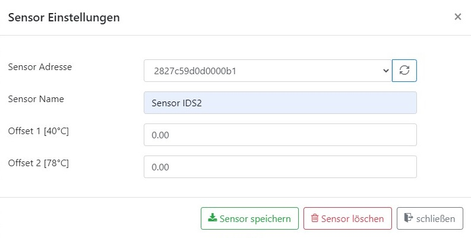
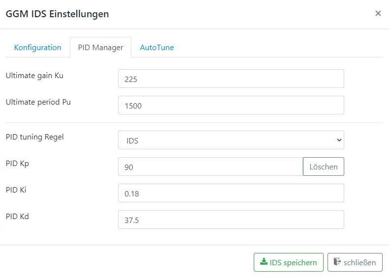

# Brautomat

Der Brautomat ist eine Brausteuerung für die Induktionskochfelder GGM IDS1 und IDS2 mit einem ESP8266 Wemos D1 mini. Der Brautomat wird im Sudhaus von Hobbybrauern eingesetzt und bietet eine intuitiv einfach zu bedienende Steuerung. Beim Maischen werden Rast-Temperaturen automatisiert angefahren und die Rastzeiten eingehalten. Ebenso unterstützt der Brautomat den Hobbybrauer beim Kochen der Würze und bei den Hopfengaben.

Die Hauptfunktionen vom Brautomat sind:

* Steuerung der Induktionskochfelder GGM IDS1 und IDS2 über einen PID-Controller
* PID AutoTune zur Ermittlung der benötigten Einstellungen
* bis zu 5 Temperatursensoren werden unterstützt
* ein Maischeplan mit bis zu 15 Teilschritten
* eine Temperatur-Steuerung für einem Nachguss Kessel (HLT)
* Steuerung von Aktoren, wie bspw. Rührwerk, Pumpen, etc.
* Temperaturverlauf im Sudhaus als Grafik (line chart)
* Maischeplan Import aus Maische Malz und mehr
* Maischeplan Import aus dem kleinen Brauhelfer2
* Maischeplan Export zur Archivierung

## Installation

Die Installation der Firmware wird über das mitgeliferte Script durchgeführt. Hierzu wird das Archiv Firmware.ZIP in einem beliebigen ordner entpackt. Ein Doppelklick auf das Script Flashen.cmd startet die Installation.

Das Script ist voreingestellt auf den seriellen Anschluss COM3. Sollte der Wemos D1 Mini nicht mit COM3 verbunden sein, muss im Script Flashen.cmd an zwei Stellen "COM3" durch den korrekten COM Port ersetzt werden.

## Updates

Updates können im Brautomat bequem über das Menü "Update" eingespielt werden. Eine neue Firmware kann über "WebUpdate" oder "Datei Update" eingespielt werden.
Die Firmware bietet ein Web Update. Über das Web Interface kann eine neue Version eingespielt werden. Ein Kabel oder das Script aus der Installation ist nicht erforderlich.
Eine zweite Möglichkeit Updates einzuspielen bietet die Möglichkeit "Datei Update". Über diese Möglichkeit muss für ein Update die Firmware Datei (.bin) ausgewählt werden.

## Grundeinrichtung

Der Brautomat benötigt als Mindestausstattung einen Temperatursensor vom Typ Dallas DS18B20 und ein Induktionskochfeld GGM IDS. Mit dieser Mindestausstattung wird im Folgenden eine Grundkonfiguration erstellt. Mit dieser sehr detaillierten Schritt-für-Schritt Anleitung gelingt auch dem Anfänger der Start in die Brausteuerung mit dem Brautomat. Es werden in der Grundeinrichtung nur die benötigten Einstellungen gezeigt. Alle optionalen Einstellungen werden später erläutert.
Hinweis: während der Weiterentwicklung des Brautomaten können sich die Menüs der aktuellen Firmware von den hier dargestellten Bildern geringfügig unterscheiden.

1. Einen Temperatursensor einrichten
Im Abschnitt Sensoren wird mit einem Klick auf das Plus Zeichen ein neuer Sensor angelegt

Sensoren vom Typ Dallas DS18B20 haben eine eindeutige Adresse. Über diese Adresse unterscheidet die Firmware intern bis zu 5 Sensoren. Die Adresse kann aus der Auswahlliste ausgewählt, aber nicht verändert werden. Als zweite Eigenschaft besitzt ein Sensor einen Namen. Über den Namen kann der Benutzer die Sensoren unterscheiden. Es empfiehlt sich, einen sprrechenden Namen zu verwenden. In dieser Grundkonfiguration hat der Sensor den Namen "Sensor IDS2.

Die Eigenschaften Offset 1 und Offset 2 werden später erläutert. Für die Grundkonfiguration belassen wir beide Werte auf 0.00. Mit einem Klick auf "Sensor speichern" wird der Sensor angelegt und im Dashboard im Abschnitt Sensoren angezeigt:

2. Das Induktionskochfeld GGM IDS einrichten
Im ersten Abschnitt "Maischeplan" wird das Induktionskochfeld über das Zahnrad angelegt

Zunächst muss das Induktionskochfeld konfiguriert werden. Die erste Eigenschaft ist der IDS Typ. Es stehen IDS1 und IDS2 zur Auswahl. Es folgen drei Parameter zur Steuerung:

* PIN weiß [Relais] - Standardeinstellung: D5
* PIN gelb [Command] - Standardeinstellung: D6
* PIN blau [Interrupt] - Standardeinstellung: D7

Als nächste Eigenschaft muss der Sensor angegeben werden, welcher mit dem Kessel auf der GGM IDS verbunden ist. In dieser Grundeinrichtung ist nur ein Sensor vorhanden und wird ausgewählt. Die drei folgenden Werte Temperatur delta und Threshold werden später erläutert und werden für die erste Grundeinrichtung nicht benötigt.

Nach der Grundkonfigruation muss der PID-Controller im Tab PID Manager eingerichtet werden. Der PID-Controller ist ein sehr wichtiges Element. Je besser der PID-Controller eingestellt ist, desto genauer wird die Rasttemperatur über die Rastzeit gehalten. Mit dem Thema PID beschäftigt sioch diese Anleitung später genauer. Für eine erste Grundeinrichtung werden folgende Werte für Ku und Pu eingetragen:

Wenn die Werte für "Ultimate gain Ku" und "Ultimate period Pu" eingetragen sind, ermittelt die Auswahl "PID tuning Regel" die drei Werte PID Kp Ki und Kd selbstständig. Eine Erläuterung aller Parameter erfolgt später. Für eine erste Grundeinrichtung sind die Standardwerte gut geeignet. Die Konfugraiton der Induktionskochplatte abspeichern.

An dieser Stelle ist die Grundkonfiguration bereits abgeschlossen. Mit einem Sensor und einer GGM IDS kann nun gebraut werden. Zum Brauen ist ein Maischeplan erforderlich.

## Sensor Kalibrierung

Sensoren vom Typ Dallas DS18B20 haben teilweise gravierende Abweichung von der tatsächlichen Temperatur. Mithilfe einer 2-Punkte Kalibrierung kann diese Abweichung korrigiert werden. Zur Kalibrierung der Sensoren wird ein geeichtes Thermometer benötigt. Der Braukessel wird mit einer typischen Menge Wasser befüllt und auf 40°C erhitzt. Der Unterschied zwischen dem Sensorwert und dem geeichten Thermometer wird im Parameter "Offset 1 [40°C]" eingetragen. Dieser Vorgang wird bei 78°C wiederholt und der Unterschied wird im Parameter "Offset 2 [78°C]" eiongetragen. Alle Sensormesswerten werden künfig anhand dieser Korrektur ausgegeben.

## Der Maischeplan

Der Brautomat hat einen Standard Maischeplan. Die folgende Beschreibung hat nicht das zugrunde liegende Rezept als Inhalt, sondern das Vorgehen beim Maischen mit dem Brautomat. Der Maischeplan hat eine Tabellenform. Diese Tabelle wird baim Maischen von oben nach unten abgearbeitet. Die Zeile "Einmaischen 50°" ist der erste Maischeschritt und "Kochen Hopfengabe 2" der letzte Maischeschritt. Jede Zeile hat diese Spalten:

* Rast ist ein Name für diesen Maischeschritt
* Temeperatur ist die Rasttemperatur
* Dauer ist die Zeit, wie lange der Brautomat die Rasttemperatur hält
* autonext besagt, ob automatisch zum nächsten Schritt gwechselt wird, wenn die Rastdauer erreicht ist

Nach diesen vier Angaben zur Rast folgen Icons mit den folgenden Funktionen

* verschiebe diese Zeile eine Position nach oben
* verschiebe diese Zeile eine Position nach unten
* editiere diese Zeile
* lösche diese Zeile
* speichere die Zeile in die Tabelle

Die Funktion von "autonext" soll an einem Beispiel erläutert werden: der zweite Schritt im Maischeplan mit dem Namen "Maltoserast 63°C  hat als Rasttemperatur 63°C und eine Rastdauer von 25 Minuten. Der Brautmoat steuert in diesem Schritt das Induktionskochfeld zunächst auf 63°C mit maximaler Leistung. Kurz vor den 63°C wird die Leistung zurückgenommen. Es sollen nicht 64°C oder mehr erreicht werden, sondern 63°C. Sobald diese 63°C erreicht sind, startet der Brautomat den Timer. Ein Timer ist eine Stoppuhr. Wenn diese Stoppuhr die Rastdauer von 25 Minuten erreicht hat, überprüft der Brautomat die Eigenschaft "autonext". Wenn das Häkchen gesetzt ist, springt der Brautomat zum nächsten Schritt im Masicheplan. In diesem Bespiel zum Schritt "Zwischenrast". Die Zwischenrast hat eine Rasttemperatur von 67°C. Automatisch erhöht der Brautomat die Leistung vom Induktionskochfeld, um die Rasttemperatur zu erreichen.

Und was passiert, wenn bei "autonext" kein Häkchen gesetzt ist? Die Eigenschaft "autonext im fünften Schritt "Abmaischen 78°C" ist nicht aktiviert. Wenn der Brautomat auf ein deaktivertes autonext trifft, beendet er die aktuelle Rast und setzt die Leistung vom Induktionskochefeld auf 0%. In diesem Status wird der "Play Button" rot angezeigt. Zum Fortsetzen des Brauvorgangs muss auf den Play Button geklickt werden:

Als aktive Rast wird auf diesem Bild "Kochen" angezeigt. Die aktuelle Leistung wird mit 0% angezeigt und der Play Button ist rot. Dieser Status ist genau dann erreicht, wenn der Schritt "Abmaischen 78°C" erledigt ist und der Brautomat auf das Fortsetzen durch eine Aktivität durch den Brauer wartet.

### Funktion Power Button

Über den Power Button wird der Maischeprozess ein- bzw. ausgeschaltet. Sobald AutoTune in den Einstellungen der GGM IDS oder im Nachguss aktiviert ist, wird der AutoTune Prozess üb den Power Button gestartet bzw. gestoppt.

### Funktion Play Button

Mit dem Play Button hat im Maischeprozess zwei Funktionen:  setze den Maischeprozess mit der nächsten Rast fort und starte sofort Rast-Timer. Die Funktionen "mit der nächsten Rast den Maischeprozess fortsetzen" wurde mit der Beschreibung "autonext" erläutert. Die zweite Funktion "starte sofort den Rast-Timer" setzt die Überprüfung der IST-Temperatur gegenüber der Rast-Temperatur aus und startet unabhängig von der IST-Temperatur den Rast-Timer. Ein Anwendungsfälle ist, wenn der Maischeprozess nicht nach Plan verläuft und der Brauer eingreifen muss. Beim Schritt Kochen der Würze kann der Rast-Timer gestartet werden, wenn augenscheinlich das wallend Kochen beginnt.

### Funktion Pause Button

Mit dem Pause Button wird der Rast-Timer im Maischeprozess angehalten. Der Play Button erschreint rot. Der Maischeprozess wird mit einem Klick auf den PLay Button fortgesetzt. Wichtig zu beachten gilt es, dass die aktuelle Temperatur gehalten wird. Hier unterscheiden sich "Pause" und "autonext": bei deaktiviertem autonext schaltet die GGM IDS ab, während bei einem pausierten Rast-Timer die aktuelle Temperatur gehalten wird.

### Funktion Forward Button

Mit dem Forward Button wird zum nächsten Schritt im Maischeplan gesprungen oder falls es der letzte Schritt im Planb war der Maischeprozess beendet.

### Funktion Graph Button

Mit dem Graph Button kann die visuelle Darstellung vom Temperaturverlauf ein- bzw. ausgeblendet werden. Zusätzlich können einzelne Graphen durch Klick auf den Graphnamen ein- und ausgeblendet werden.

## AutoTune

AutoTune hat die wichtige Aufgabe, passende Parameter für die Brauanlage zu ermitteln, damit der Maischeprozess exakt durchgeführt wird. Im Fokus stehen die IST- und die zugehörigen SOLL-Temperaturen. In der Praxis bedeutet dies, dass ein Über- und Unterschwingen vermieden werden soll.

Die folgende Beschreibung dient ausschließlich als Hilfe zur Verwendung der Firmware.
Der PID-Controller steuert die Leistung der Induktonsplatte. Es ist wichtig, geeignete P I D Werte zu ermitteln. Dabei sind die PID Werte je Brauanlage und Umgebung individuell. AutoTune ist ein Prozess, der bei der Ermittlung geeigneter Werte unterstützt.
Die benötigte Leistung der Induktionsplatte, um von der Ist-Temperatur zur Zieltemperatur zu gelangen, wird aus der Summe der drei Werte berechnet:
Erforderliche Leistung = P + I + D

### Der P-Wert

Dieser Parameter wirkt auf der Basis Unterschied zwischen Ist und Soll. Je größer der Unterschied zwischen der Ist- und der Zieltemperatur ist, desto stärker heizt die Induktionsplatte mit dem P-Anteil. Ist die Zieltemperatur erreicht oder überschritten, ist der P-Anteil gleich 0. Ein reiner P-Regler kann daher nie die Zieltemperatur erreichen, weil beim Erreichen der Zieltemperatur P = 0 ist und somit gar nicht mehr geheizt wird. Ein sehr hoher P-Wert bewirkt ein starkes Über- bzw. Unterschwingen.

### Der I-Wert

Der I-Wert wird, während die Induktionsplatte heizt, bei null beginnend fortlaufend größer. Je länger die Induktionsplatte von der Ist-Temperatur zur Zieltemperatur benötigt, desto größer wird der I-Wert. Zusammen mit dem P-Wert ergibt sich nun folgende Addition:
Der P-Wert wird bei Annäherung an die Zieltemperatur kleiner und der I-Wert größer. Nur über den I-Wert wird die Zieltemperatur erreicht. Der I-Wert wird oberhalb der Zieltemperatur wieder kleiner. Der I-Wert erzeugt ein Überschwingen.

### Der D-Wert

Der D-Wert ist ein Dämpfer, der die Schwingungen der ersten beiden Anteile mindert. Ein zu starker D-Anteil verlangsamt das Auf- und Nachheizen der Induktionsplatte. Dieser Wert kann auch null sein.

### Der AutoTune Prozess: Schritt für Schritt

Das praktische Vorgehen AutoTune schaut wie folgt aus:

1. Befülle Deinen Kessel mit einer typischen Menge Wasser

    a. Eine typische Menge entspricht dem Hauptguss + Schüttung

    Beispiel: 20l Hauptguss und 5kg Schüttung ergibt eine typische Menge von 25l

    b. Schalte das Rührwerk ein

2. Setze eine AutoTune Zieltemperatur. Die Zieltemperatur sollte mindestens 10°C über der aktuellen Ist-Temperatur liegen.
3. Aktiviere „PID AutoTune“
4. Aktiviere „AutoTune debug“
5. Speichere diese Einstellung ab (IDS speichern)
6. Mit einem Klick auf den grünen Power Button wird "AutoTune IDS" gestartet.

Der AutoTune Prozess dauert je nach Umgebung 45 bis 90min. Der meiste Zeitbedarf entsteht während den Abkühlphasen. Der aktuelle Status ist in der Spalte „in progress 0/5“ sichtbar. Treten Fehler auf, erscheint an dieser Stelle „in progress 6/5“ und höher. Der AutoTune Prozess prüft die gefundenen Messerte. Ist ein Messwert fehlerhaft, wird die Messung wiederholt. Es werden maximal 20 Wiederholungen durchgeführt.

Das AutoTune Ergebnis wird in den Einstellung der GGM IDS (Zahnrad) im Tab PID-Manager dargestellt:

Das Ergebnis von AutoTune sind die Werte von "Ultimate gain Ku" und "Ultimate period Pu". Diese zwei Werte bitte notieren bzw. ein Backup der config.txt erstellen. Aus diesen zwei Brauanlagen-Werten werden die PID-Werte berechnet werden.

## Alle GGM IDS Parameter im Überblick

### Max. Leistung IDS

Dieser Parameter beschreibt die maximale Ausgangsleistung der GGM IDS. Der Standardwert ist 100%. Dieser Parameter kommt zum Einsatz, wenn ein kleiner Kessel mit bspw. 20l Volumen auf der GGM IDS genutzt wird. Durch Reduzierung der Leistung der IDS kann ein zu schnelles Aufheizen und ein Überkochen vermieden werden. Die Parameter "Max. Leistung IDS" und "Leistung kochen" sollten in Umgebungen mit kleineren Braukesseln zusammen betrachtet werden.

### Temperatur delta zum Ziel

Dieser Parameter beschreibt, ab welcher Differenz zur Rasttemperatur der Timer einer Rast starten soll. Der Standardwert ist 0.3°C.
Im Maischeprozess ermöglicht der PID Controller eine sehr genaue Temperatursteuerung. Eine Rasttemperatur wird mit +-0.2°C genau erreicht, indem der PID Controller die Energiezufuhr kurz vor Erreichen der Rasttemperatur kontrolliert reduziert. Würde die Energiezufuhr erst mit Erreichen der Rasttemperatur reduziert werden, wäre ein deutliches Überschwingen um mehr als 1°C unvermeidlich. Die Reduzierung der Energiezufuhr hat als Nebeneffekt, dass der letzte Schritt zum Erreichen der Rasttemperatur länger dauert. Genau an dieser Stelle kommt der Parameter "delta zum Ziel" ins Spiel: soll bspw. eine Rasttemperatur von 63°C erreicht werden und ist die aktuelle Temperatur 62.7°C, dann würde mit einem Temperatur delta zum Ziel von 0.3°C der Rasttimer starten. Bezogen auf die individuelle Brauanlage kann mit delta zum Ziel eine ungewollte Verlängerung der Rastzeit vermieden werden. Zu beachten gilt auch, dass die IST-Temperatur mit einer Genauigkeit von 0.125°C ermittelt wird.

### Temperatur Kochen

Dieser Parameter beschreibt die Temperatur, ab der der PID Controller das Kochen der Würze erkennen soll. Der Standardwert ist 98°C. Dieser Parameter beschreibt NICHT, ab welcher Temperatur die Würze beginnt zu kochen! Anders als bei den Rasttemperaturen ist beim Kochen nicht das genaue erreichen und halten der Temperatur das Ziel, sondern das wallend kochen. Es ist in den allermeisten Fällen nicht erwünscht, dass der PID Controller kurz vor dem Kochen bei ca. 100°C die Leistung reduziert. Die Temperatur Kochen beschreibt also die Temperatur, ab der der PID Controller deaktiviert wird. Je nach Umgebung ist dieser Wert auf 95°C zu setzen.

### Leistung Kochen

Dieser Parameter beschreibt die Ausgangsleistung der IDS ab der Temperatur Kochen. Der Standardwert ist 100%. Mit dem Parameter "Temperatur kochen" ist eine Temperatur festgelegt worden, ab der der PID Controller deaktiviert wird. Mit dem Parameter "Leistung kochen" wird nun die feste Ausgangsleistung der IDS ab der Temperatur Kochen vorgegeben. Wird ein Braukessel mit großem Volumen (40l oder mehr) eingesetzt, ist der Standardwert 100% eine passende Wahl. In Brauküchen mit kleinen Kesseln kann 100% Energiezufuhr zum Kochen ein Überkochen bewirken. In diesem Fall kann die maximale Energiezufuhr mit diesem Parameter auf bspw. 75% reduziert werden.

Diese vier Parameter sind je Brauanlage individuell einzustellen. Die Parameter können während eines Maischeprozesses geändert werden. Mit einem Testlauf mit einer typischen Menge Wasser können die Paramter vor einem Brautag leicht ermittelt werden.

### AutoTune noiseband

Dieser Parameter wird für die Erkennung von Extremwerten (Max, Min) verwendet. AutoTune noiseband gibt an, welche Mindeständeurng zum vorherigen Messwert vorhanden sein muss, um einen neuen Extremalwert zu erkennen. Der Standardwert beträgt 0.2. Es gilt zu beachten, dass die Messgenauigkeit bei 0.125 liegt.

### AutoTune Intervall

Dieser Parameter gibt an, in welchem zeitlichen Abstand Messwerte ermittelt werden. Der Standardwert ist 5000ms. Zu beachten gilt, dass der Temperatursensor alle 2500ms abgefragt wird.

### AutoTune Datenreihe

Dieser Parameter gibt an, wie viele Messwerte für die Ermittlung von Extremalwerten betrachtet werden sollen. Der Standardwert beträgt 75 Messwerte. Zu beachten gilt, dass maximal 100 Messwerte konfiguriert werden können. Bei sehr gut wärmeisolierten Braukesseln (bspw. mit Armaflex) kann eine Erhöhung auf 100 Messwerte in der Datenreihe die Erkennung von Extremalwerten in der Abkühlphase vom AutoTune Prozess verbessern.

## Alle System Parameter im Überblick

### Aktiviere Alarm-Buzzer

Mit diesem parameter kann ein Piezo Buzzer aktiviert werden. Zu beachten gilt, dass der Buzzer an GPIO D8 angeschlossen sein muss. Buzzer Alarme unterstützen den Maischeprozess durch Signaltöne.

### Aktiviere Info Nachrichten Toasts

Toasts sind kleine Push Nachrichten. Die Nachrichten erscheinen als Kachel oben rechts im Browser. Toasts vom Typ Information verschwinden nach wenigen Sekunden selbstständig. Toasts vom Typ Warnung oder Fehler verbleiben im Browserfenster, bis der User die wegklickt.

### Aktviere Porterweiterung PCF8574

Mit diesem Parameter kann eine 8-Port GPIO Erweiterung am ESP8266 betrieben werden. Zu beachten gilt, dass die Port Erweiterung an D5, D6 angeschlossen werden muss. Der Interrupt Modus wird nciht unterstützt.

### Aktiviere Touchdisplay

Mit diesem Parameter kann ein Nextion HMI 3.5 Zoll Display betrieben werden. Zu beachten gilt, dass SDA, SCL an den PINs D1, D2 betrieben werden. Ein Display ist optional. Der Brautomat unterstützt ausschließlich Nextion HMI 3.5 Zoll Displays.
