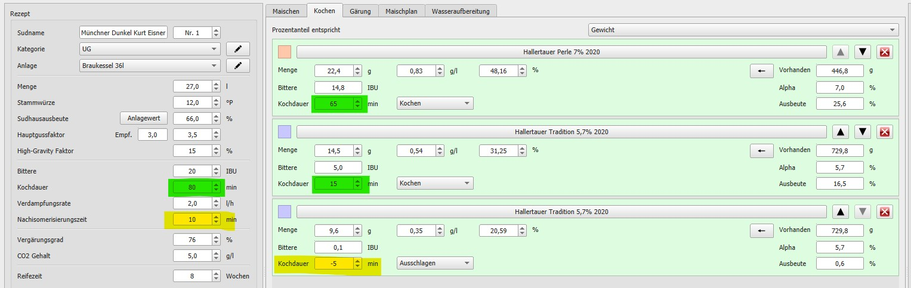
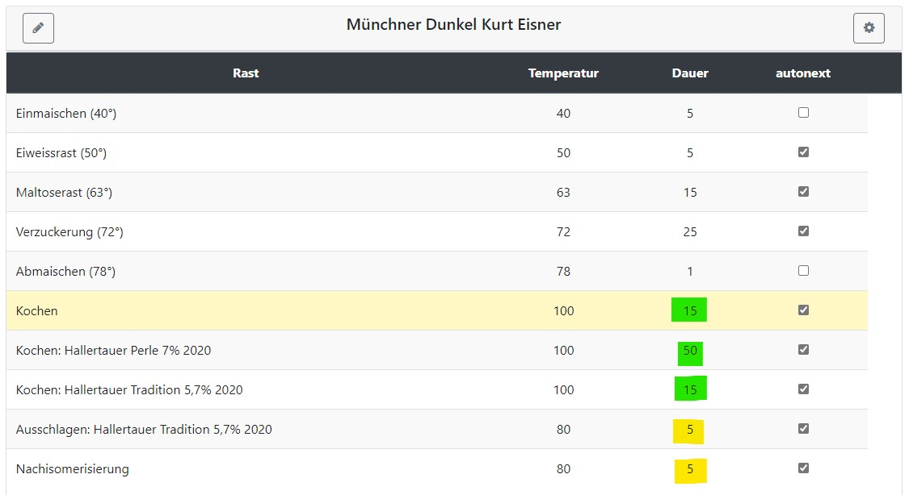

# KleinerBrauhelfer2

Ab Version 2.5.0 hat das Programm [kleinerBrauhelfer2](https://github.com/kleiner-brauhelfer/kleiner-brauhelfer-2) einen Export Filter für den Brautomat. Die Rezeptentwicklung und Gestaltung ist mit den kbh2 in allen erdenklichen Details möglich. Mit dem Spickzettel bietet der kbh2 einen sehr guten und hilfreichen Ablaufplan für die praktische Umsetzung in der Brauküche. Mit dem Export Filter für den Brautomat können fast alle Schritte im Sudhaus vereinfacht werden.

## Der kbh2 Tab Maischplan

Im Tab Maischplan bietet der kbh2 vier verschiedene Arten Malze zur Maische hinzuzufügen: Einmaischen, Aufheizen, Zubrühen und Dekoktion. Alle vier Arten werden im Brautomat unterstützt. Der Typ Einmaischen wird automatisch mit deaktiviertem autonext eingefügt. Aufheizen und Zubrühen mit aktiviertem autonext. Die Dekoktion ist aber nur mit halber automatik möglich (autonext).

Einen Typ Abmaischen kennt der kbh2 nicht, weil er diesen Typ auch nicht benötigt. Der Brautomat benötigt diesen Maischeschritt, um das Ende vom Maischen und den Übergang zum Läutern zu erkennen. Es sollte in jedem Maischplan ans Ende ein Schritt Abmaischen vom Typ "Aufheizen" mit 76°C oder höher und einer Dauer von 1 Minute angefügt werden. In dieser Kombination wird Abmaischen vom Brautomat erkannt und mit deaktiviertem autonext eingefügt.

## Der kbh2 Tab Kochen

Der kbh2 denkt anders, als der Brautomat. Eine Zeitangabe im kbh2 im Tab Kochen bedeutet "wie lange wird die Hopfengabe gekocht". Aus der Kochdauer ergeben sich u. a. Bittere und Aroma. Siehe Formelsammlung im kbh2.

Im Bild kbh2 ist die Hopfengabe dargestellt. Die erste Hopfengabe ist "Hallertauer Perle 7% 2020" mit einer Kochdauer von 65 Minuten. Ein zweiter Parameter ist in diesem Zusammenhang wichtig: auf der linken Seite ist die gesamte Kochdauer mit 80 Minuten grün markiert. Die Würze wird also 15 Minuten lang ohne Hopfen gekocht. Die zweite Hopfengabe ist der "Hallertauer Tradition 5.7% 2020" Hopfen mit einer Kochdauer von 15 Minuten. In den letzten 15 Minuten Kochen der Würze hat die Hallertauer Perle von ursprünglich 65 Minuten noch 15 Minuten Kochzeit übrig und die zweite Hopfengabe Hallertauer Tradition kocht 15 Minuten lang von den verbliebenen 15 Minuten Restkochzeit mit. Die letze Hopfengabe wird zum Ausschlagen gegeben, also nach dem Kochende.

Die Aufgabe vom Brautomat ist den Zeitpunkt der Hopfengabe beim Brauen anzugeben und am besten mit einem aktustischem Signal an die Hopfenhgabe zu erinnern. Um den Zeitpunkt der Hopfengabe während des Kochens zu bestimmen, ist es einfacher "von hinten" anzufangen. Die letzte Hopfengabe "Hallertauer Tradition 5.7% 2020" wird zum Ausschlagen gegeben. Beim Ausschlagen ist das Kochen beendet. Also zählt die Hopfengabe Ausschlagen nicht zur gesamten Kochdauer. Eine Hopfengabe weiter zurück ist der "Hallertauer Tradition 5.7% 2020" Hopfen mit einer Kochdauer von 15 Minuten. Eine Hopfengabe weiter zurück kommt die Hallertauer Perle mit einer Kochdauer von 65 Minuten. Von den 65 Minuten sind 15 Minuten lang Hallertauer Tradition und Perle zusammen im in der Würze. 65 Minuten abzüglich 15 Minuten ergibt den zeitlichen Abstand der Hopfengaben von 50 Minuten. Es muss der Hopfen Perle 50 Minuten vor der Hopfengabe Tradition gegeben werden.

Vorgegeben ist in diesem Beispiel eine gesamte Kochedauer von 80 Minuten und eine erste Hopfengabe mit einer Kochdauer von 65 Minuten. Daraus ergibt sich eine Differenz von 15 Minuten Kochedauer ohne Hopfengabe.

In gleicher Weise verhält sich die Hopfengabe Ausschlagen. Es ist eine Nachisomerisierungszeit von 10 Minuten gegeben. Die Hopfengabe "Hallertauer Tradition 5.7% 2020" zum Ausschlagen mit einer Kochdauer von -5 Minuten ist Teil der Nachisomerisierung.
