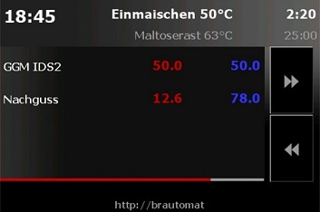
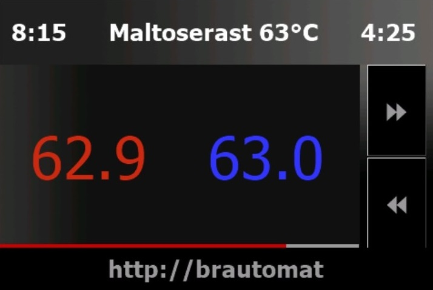
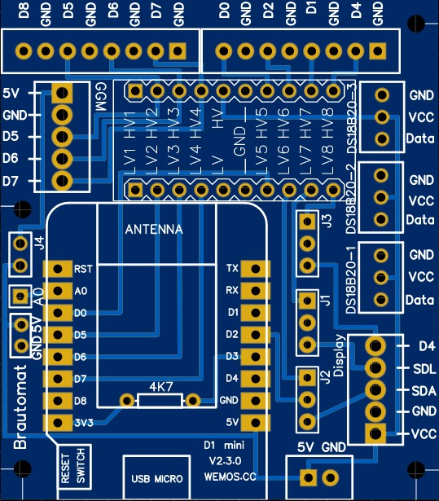
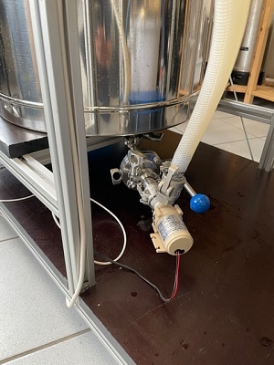
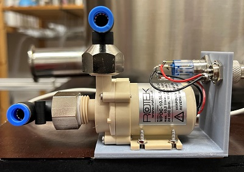
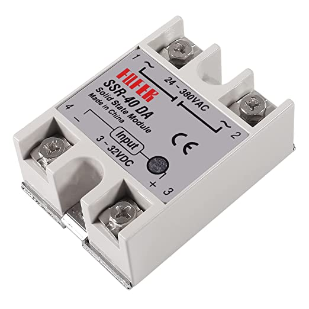
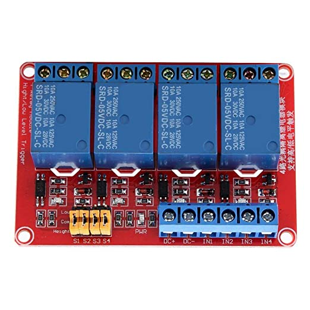
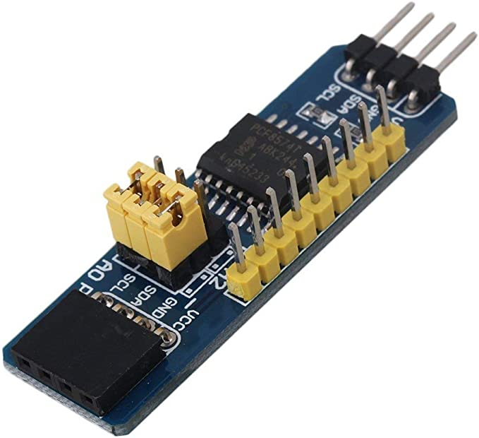

# Sonstiges

## Alle GGM IDS Parameter im Überblick

### Max. Leistung IDS

Dieser Parameter beschreibt die maximale Ausgangsleistung der GGM IDS. Der Standardwert ist 100%. Dieser Parameter kommt zum Einsatz, wenn ein kleiner Kessel mit bspw. 20l Volumen auf der GGM IDS genutzt wird. Durch Reduzierung der Leistung der IDS kann ein zu schnelles Aufheizen und ein Überkochen vermieden werden. Die Parameter "Max. Leistung IDS" und "Leistung kochen" sollten in Umgebungen mit kleineren Braukesseln zusammen betrachtet werden.

### Temperatur delta zum Ziel

Dieser Parameter beschreibt, ab welcher Differenz zur Rasttemperatur der Timer einer Rast starten soll. Der Standardwert ist 0.3°C. Im Maischeprozess ermöglicht der PID Controller eine sehr genaue Temperatursteuerung. Eine Rasttemperatur wird mit +-0.2°C genau erreicht, indem der PID Controller die Energiezufuhr kurz vor Erreichen der Rasttemperatur kontrolliert reduziert. Würde die Energiezufuhr erst mit Erreichen der Rasttemperatur reduziert werden, wäre ein deutliches Überschwingen um mehr als 1°C unvermeidlich. Die Reduzierung der Energiezufuhr hat als Nebeneffekt, dass der letzte Schritt zum Erreichen der Rasttemperatur länger dauert. Genau an dieser Stelle kommt der Parameter "delta zum Ziel" ins Spiel: soll bspw. eine Rasttemperatur von 63°C erreicht werden und ist die aktuelle Temperatur 62.7°C, dann würde mit einem Temperatur delta zum Ziel von 0.3°C der Rasttimer starten. Bezogen auf die individuelle Brauanlage kann mit delta zum Ziel eine ungewollte Verlängerung der Rastzeit vermieden werden. Zu beachten gilt auch, dass die IST-Temperatur mit einer Genauigkeit von 0.125°C ermittelt wird.

### Temperatur Kochen

Dieser Parameter beschreibt die Temperatur, ab der der PID Controller das Kochen der Würze erkennen soll. Der Standardwert ist 95°C. Dieser Parameter beschreibt NICHT, ab welcher Temperatur die Würze beginnt zu kochen. Dieser Parameter beschreibt die Temperatur, ab der der Brautomat den PID Controller deaktiviert und mit einer vorgegebenen Leistung "Leistung Kochen" das Induktionskochfeld steuert. Anders als bei den Rast-Temperaturen ist beim Kochen nicht das genaue erreichen und halten der Temperatur das Ziel, sondern das wallend Kochen. Anstatt also die Leistung zu reduzieren, wird beim Kochen das Induktionskochfeld mit einer gleichbleibenden Leistng betrieben.

_Tipp: Bei Ist-Temperaturen über dem Wert Temperatur Kochen und über der Rast-Temepratur wird der Parameter "Temperatur Delta zum Ziel" nicht beachtet._

### Leistung Kochen

Dieser Parameter beschreibt die Ausgangsleistung der IDS ab der Temperatur Kochen. Der Standardwert ist 100%. Mit dem Parameter "Temperatur kochen" ist eine Temperatur festgelegt worden, ab der der PID Controller deaktiviert wird. Mit dem Parameter "Leistung kochen" wird nun die feste Ausgangsleistung der IDS ab der Temperatur Kochen vorgegeben. Wird ein Braukessel mit einem Volumen über 35l oder mehr eingesetzt, ist der Standardwert 100% eine passende Wahl. In Brauküchen mit kleinen Kesseln kann 100% Energiezufuhr zum Kochen ein Überkochen bewirken. In diesem Fall kann die maximale Energiezufuhr mit diesem Parameter auf bspw. 75% reduziert werden.

Diese vier Parameter sind je Brauanlage individuell einzustellen. Die Parameter können während eines Maischeprozesses geändert werden. Mit einem Testlauf mit einer typischen Menge Wasser können die Paramter vor einem Brautag leicht ermittelt werden.

### AutoTune noiseband

Dieser Parameter wird für die Erkennung von Extremwerten (Max, Min) verwendet. AutoTune noiseband gibt an, welche Mindeständeurng zum vorherigen Messwert vorhanden sein muss, um einen neuen Extremalwert zu erkennen. Der Standardwert für die GGM IDS beträgt 0.2. Für einen Nachguss Kocher über ein Relais oder SSR beträgt der Standardwert 0.3. Es gilt zu beachten, dass die Messgenauigkeit bei 0.125 liegt.

### PID Intervall

Dieser Parameter gibt an, in welchem zeitlichen Abstand eine Berechnung der benötigten Leistung ermittelt werden. Der Standardwert ist 5000ms. Das Intervall wird zur PID Berechnung und im AutoTune eingesetzt. In Brauküchen mit kleinem Volumen ist ein kleineres Intervall ggfs. vorteilhaft. Je kleiner das Intervall, desto häufiger werden Sensoren abgefragt und PID Werte berechnet. Dies führt zur einer höheren Auslastung des Wemos.

### AutoTune Datenreihe

Dieser Parameter gibt an, wie viele Messwerte für die Ermittlung von Extremalwerten betrachtet werden sollen. Der Standardwert für eine GGM IDS beträgt 75 Messwerte, bei einem Nachguiss Kocher beträgt der Standardwert 50. Zu beachten gilt, dass maximal 100 Messwerte konfiguriert werden können. Bei sehr gut wärmeisolierten Braukesseln (bspw. mit Armaflex) kann eine Erhöhung auf 100 Messwerte in der Datenreihe die Erkennung von Extremalwerten in der Abkühlphase vom AutoTune Prozess verbessern.

***

## Alle System Parameter im Überblick

### Aktiviere Alarm-Buzzer

Mit diesem parameter kann ein Piezo Buzzer aktiviert werden. Zu beachten gilt, dass der Buzzer an GPIO D8 angeschlossen sein muss. Buzzer Alarme unterstützen den Maischeprozess durch Signaltöne.

### Aktiviere Toasts und mp3 Alarme

Toasts sind kleine Push Nachrichten. Die Nachrichten erscheinen als Kachel unten rechts im Browser. Nach ca. 10sek verschwinden die Toasts wieder. Es gibt Toast Nachrichten zum Maischeprozess, Toast Nachrichten vom System und textlose mp3 Alarme. Dazu passend hat die Eigenschaft Toasts 3 Optionen: Aus, Ein und Fehler. Die Auswahl "Aus" schaltet Toast Nachrichten ab. Die Option "Ein" sendet alle Toasts Nachrichten und mp3-Alarme. Die Option "Fehler" sendet nur Toast Nachrichten bei Systemfehler, aber keine Nachrichten zum Maischeprozess.

Toasts unterstützen eine Audio Ausgabe. So werden Toasts im Maischeprozess nicht nur zu einer visuelle, sondern auch einer akkustischen Erinnerung. Die Firmware beinhaltet die Audio Dateien info.mp3, success.mp3, warning.mp3 und error.mp3. Die Audio Dateien (mp3) können ausgetauscht werden. Lediglich die Benennung muss gleich bleiben. Im Browser sollte Autoplay Audio für die IP-Adresse des Brautomaten erlaubt sein.

_Tipp: iOS Geräte -_ _mp3 Audio benötigt auf iOS Geräten eine "user gesture", bspw. ein Klick oder Touch event. Einfach ein Element auf der Webseite anklicken und mp3 Audio wird ausgegeben. Ohne die user gesture wird die Audio Ausgabe vom iOS System blockiert_

_Tipp: automatische Medienwiedergabe -_ _Alle gängigen Browser wie MS Edge, Chrome oder Firefox haben in den Einstellungen unter Webseitenberechtigung Optionen für die automatische Medienwiedergabe. Es wird empfohlen, die Webseite vom Brautomat in die Liste "Zulassen" hinzuzufügen. Im folgenden Bild ist die Webseite vom Brautomat mit dem mDNS Namen im Microsoft Edge Browser hinzugefügt worden. Alternativ kann auch die IP-Adresse eingetragen werden_


Mit dieser Einstellung können mp3 Alarme einen Piezo Buzzer ersetzen. Treten beim Systemstart Fehler auf, werden mp3 Audio Signale auf iOS Geräte blockiert. Erst nach einem Klick oder Touch werden mp3 Audio Dateien wiedergegeben. Als workaround für iOS Geräte kann nach dem ersten Start direkt ein Neustart initiert werden. Der Neustart muss als Klick bzw. Touch über System -> Neustart durchgeführt werden. Durch diese "user gesture" werden mp3 Medien automatisch wiedergegeben.

Toast Nachrichten und mp3 Alarme können systembedingt wenige Sekunden zeitverzögert zugestellt werden. Jeder Browser erhält seine eigenen Nachrichten. Zwei Geräte mit geöffnetem Browser auf den Brautomat erhalten (systembedingt) die gleiche Toast Nachricht bis zu 2 Sekunden zeitversetzt. Voreingestellt werden Toasts spätestens nach 60 Sekunden gelöscht. Innerhalb dieser 60 Sekunden überscheiben neue Toasts ältere Nachrichten (keine Stapelverarbeitung).

_Toasts in der Praxis_ _In der Brauküche wird meist ein Gerät und ein Browser mit dem Brautomat verwendet. Toasts mit mp3 Audio bieten eine einfache und laute akkustische Aufforderung zum Handeln. Deshalb ist es vorteilhaft, wenn die Enegerieoptionen beim Brauen deaktiviert werden und der Browser während des Brauens durchgehend aktiv ist. Wenn die Brauküche verlassen wird, sind Toasts auf einem Smartphone oder Tablet eine optischer und akkustischer Begleiter. Auch mobile Geräten müssen durchgehend aktiv sein. Toasts melden sich auf allen verbundenen Browsern. Anders gesagt: jeder Browser merkt sich, welche Toast ID bereits angezeigt wurde. Es ist richtig und gewollt, wenn ein PC Browser und ein Smartphone die gleiche Toast Nachricht minimal zeitversetzt anzeigen_

### Aktviere Porterweiterung PCF8574

Mit diesem Parameter kann eine 8-Port GPIO Erweiterung am ESP8266 betrieben werden. Zu beachten gilt, dass die Port Erweiterung an D5, D6 angeschlossen werden muss. Der Interrupt Modus wird nciht unterstützt.

### Aktiviere Touchdisplay

Mit diesem Parameter kann ein Nextion HMI 3.5 Zoll Display betrieben werden. Der Brautomat bietet drei Ansichten

```
- die Kessel Seite:     auf dieser Ansicht werden IDS und Nachguss mit Ist- und Zieltemperaturen dargestellt.
                        Die aktuelle und die nächste Rast werden mit Dauer angezeigt.
                        Die Länge vom rote Balken unter der Ansicht IDS und Nachguss zeigt die erledigte Rastdauer an.  
```



```
- die Brauen Seite:     auf dieser Ansicht wird das Induktionskochfeld dargestellt.
                        Es wird nur die aktuelle Rast mit Dauer im Kopf angezeigt.
                        Die Länge roter Balken unter den Temperaturen den Fortschrit der aktuellen Rast an.
```



```
- die Kochen Seite:     auf dieser Ansicht ist für die manuelle Steuerung vom Induktionskochfeld
                        Im manuellen Betrieb stehen 6 Powerstufen zur Verfügung: 0, 20, 40, 60, 80 und 100% Leistung
                        Der manuelle Betrieb ist nur für die GGM IDS2 geeignet. (IDS1 nicht getestet!) 
```


Ein Display ist optional. Der Brautomat unterstützt ausschließlich Nextion HMI 3.5 Zoll Touchdisplays (Basic und Discovery Series).

Das Display wird mit einer SD Karte konfiguriert. Die zum Display passende TFT Datei aus dem Ordner Info wird auf eine SD Karte kopiert und in das Display eingesteckt. Sobald das Display eingeschaltet wird, startet die Konfiguration. Der Vorgang dauert etwa eine Minute. Im Display steht der Fortschritt. Sobald die Konfiguration aufgespielt ist, wird das Display abgeschaltet und die SD Karte entfernt. Das Display ist nun einsatzbereit.

Zu beachten gilt, dass SDA, SCL an den PINs D1, D2 betrieben werden müssen.

***

## Beschreibung aller Buttons

Der Maischeplan verfügt über Buttons zum Editieren, erweitern oder Löschen der Tabelle. Diese sind eher selbsterklärend.

### Der grüne Speichern Button

Mit dem günen Button Tabelle speichern in der Kopfzeile der Tabelle Maischeplan wird der Inhalt der Tabelle in eine Datei (JSON) abgespeichert.

### Der blaue Speichern Button

Mit dem blauen Button Zeile speichern wird die Ändeurng der aktuellen Zeile in die Tabelle übernommen.

### Der Aktualisiere Maischeplan Button

Mit dieser Funktion wird die Tabelle neu aus der Datei eingelesen. Zu beachten gilt, dass alle nicht gespeicherten Änderungen ohne Rückfrage verworfen werden.

### Der Löschen Button

Mit dem Löschen Button wird die gesamte Tabelle geleert. Zu beachten gilt, dass erst mit Klick auf Tabelle Speichern die Änderung übernommen wird.

### Der + Button

Mit dem Plus-Button wird eine neue Rast hinzugefügt. Zu beachten gilt, dass die neue Zeile in der Tabelle mit Klick auf das blaue Speichern-Symbol in der Tabellenzeile übernommen werden muss und abschließend mit einem Klick auf das grüne Speichern-Symbol die Tabelle gespeichert wird.

### Der Graph Button

Mit dem Graph Button kann die visuelle Darstellung vom Temperaturverlauf ein- bzw. ausgeblendet werden. Zusätzlich können einzelne Graphen durch Klick auf den Graphnamen ein- und ausgeblendet werden. Die Standardeinstellung auf sichtbar eingestellt.

_Tipp: Wenn der Temperaturverlauf nicht interessant ist, einfach auf den grünen Graph Button klicken. Sobald die Grafik ausgeblendet ist, einmal die Systemkonfiguration öffnen und auf Speichern klicken. So wird die Einstellung Grafik Temperaturverlauf aus- bzw. einblenden gespeichert._

### Der Auge Button

Mit dem Auge-Button können Teile der Webseite sichtbar bzw. unsichtbar geschaltet werden. Wen bspw. keine Aktoren eingesetzt werden, kann die Tabelle Aktoren ausgeblendet werden. Die Standardeinstellung ist auf nicht sichtbar vorbelegt.

_Tipp: alle nicht benötigten Elemente auf der Webseite ausgeblenden und anschließend die Systemkonfiguration öffnen und auf Speichern klicken. Damit übernimmt der Brautomat die Einstellung und blendet beim nächsten Start alle markierten Elemente aus._

***

## Die Platine



Die Platine zum Projekt Brautomat macht den Aufbau und die Verwendung sehr einfach. Dabei ist die Platine völlig unabhängig vom Projekt Brautomat. Mit einem ESP8266 Wemos D1 mini kann die Platine universell eingesetzt werden. An die Schraubklemmblöcke werden beim Brautomat die GGM IDS, die Sensoren, die Aktoren und das Display angeschlossen.

### Jumperpositionen

Die Platine hat 4 Jumper. Die Jumper J1, J2 und J3 müssen mindestens auf _2-3_ gesetzt werden.

```
Jumpereinstellung Kurzform
- Wird ein Display eingesetzt, müssen J1 und J2 auf 1-2 gesteckt sein. 
- Wir kein Display eingesetzt, müssen J1 und J2 auf 2-3 gesteckt sein. 
- J3 wird immer auf 2-3 gesteckt.

1. Jumper J1: Pin D1 
    - In der Position 1-2 wird Pin D1 (GPIO 5) auf den Displayanschluss umgeleitet (SDL)
    - in der Position 2-3 wird kein Display verwendet (default)
2. Jumper J2: Pin D2
    - In der Position 1-2 wird Pin D2 (GPIO 4) auf den Displayanschluss umgeleitet (SDA)
    - in der Position 2-3 wird kein Display verwendet  (default)
3. Jumper J3: Pin D4
    - In der Position 1-2 wird Pin D4 (GPIO 2) auf den Displayanschluss umgeleitet.
    - in der Position 2-3 wird Pin D4 nicht umgeleitet (default)

4. Jumper J4: Stromzufuhr über GGM IDS
    - wenn der Jumper J4 gesetzt ist, wird die Stromzufuhr von der GGM IDS für den Brautomat genutzt.
    - wenn der Jumper J4 nicht gesetzt ist, wird die Stromzufuhr an den Anschluss *5V* und *GND* angeklemmt.
```

### Teileliste

| Anzahl                                                | Artikelname                    | Link zum Artikel                  |
| ----------------------------------------------------- | ------------------------------ | --------------------------------- |
| 1                                                     | Schraubklemmblock 2pol 2,54    | (eg voelkner )                    |
| 3                                                     | Schraubklemmblock 3pol 2,54    | (eg voelkner )                    |
| 2                                                     | Schraubklemmblock 5pol 2,54    | (eg voelkner )                    |
| 2                                                     | Schraubklemmblock 8pol 2,54    | (eg voelkner )                    |
| 1                                                     | JST-HX Buchse 90° 2,54         | (eg voelkner )                    |
| 1                                                     | Stiftleiste 2,54               | [amazon](https://amzn.to/40Q8Nbv) |
| 4                                                     | Jumper 2,54                    | (eg voelkner )                    |
| 1                                                     | Widerstand 4,7kOhm             | [amazon](https://amzn.to/40OLPBA) |
| 1                                                     | D1 mini NodeMcu ESP8266        | [amazon](https://amzn.to/3RWwyL5) |
| 1                                                     | LevelShifter 8 Channel 5V 3.3V | [amazon](https://amzn.to/3xjkN7S) |
| _Links nach amazon Partner und Voelkner TradeTracker_ |                                |                                   |

Die Position JST-HX Buchse ist für das original Anschlusskabel vorgesehen. Wird ein Ersatzkabel (ohne JST-HX Stecker) verwendet, kann an gleicher Stelle auf der Platine ein Schraubklemmblock 5pol im Rastermaß 2,54mm eingesetzt werden. Der Schaubklemmblock 2pol kann wahlweise unten rechts oder mittig links neben dem Wemos D1 mini eingesetzt werden.

_Tipp:_ _der ESP8266 sollte gesockelt werden. Mit Sockel (im Link oben enthalten) ist ausreichend Platz für den Widerstand unter dem ESP8266. Falls eine Fehlersuche erforderlich ist, kann ein gesockelter ESP8266 von der Platine abgesteckt werden._

Die Anschlüsse vom LevelShifter 8 Kanal müssen zur Anordnung auf der Platine identisch sein. Der Levelshifter aus dem Link hat diese Anordnung der Anschlüsse.


## Beispiele für Aktoren

### Pumpen



Eine Pumpe ist beim Läutern oder beim Transport in den Gärbehälter eine große Hilfe. Die verwendete Pumpe muss lebensmittelecht sein und für Temperaturen bis 100°C geeignet sein. Die Minipumpen von Rotekt eignen sich sehr gut für den Einsatz in der Brauküche:



| Artikelname                                            | Link zum Artikel                  |
| ------------------------------------------------------ | --------------------------------- |
| Mini-Pumpe 12V DC                                      | [amazon](https://amzn.to/3E4iRUF) |
| Mini-Pumpe 12V DC                                      | [amazon](https://amzn.to/3E4iRUF) |
| Pneumatische Steckverbinder 8mm x 1/2 Zoll 90° drehbar | [amazon](https://amzn.to/3XmH2nP) |

Ebenfalls sehr gut und schnell sind Verbdinungen mit [Camlocks von Braubebo](https://www.braubebo.de/camlock/) wie auf dem ersten Bild dargestellt.

### SSR Solid State Relais

Mit dem Brautomat können sehr einfach SSRs geschaltet werden. SSR oder Solid State Relais schalten mit 3-5V Gleichstrom vom Brautomat den 220V Wechselstromkreis ein- bzw. aus. Die Fotek SSRs sind ideal zur Temperaturregelung und Steuerung über den Brautomat.



| Artikelname    | Link zum Artikel                  |
| -------------- | --------------------------------- |
| Fotek SSR 40DA | [amazon](https://amzn.to/3RSzKav) |

Anwenungsbeispiele für SSR: Wenn 220V an einem SSR Fotek über den Brautomat geschaltet wird, kann am "anderen Ende" der 220V Leitung eine Steckdose für einen beliebiges Gerät mit Stecker angebracht werden. Zum Beispiel für das Netzteil vom Rührwerk. Oder für einen Nachgusskocher. Oder für ein Ringheizlement. Auch das Netzteil der Rotek Pumpe kann über ein SSR ein- und ausgeschaltet werden.

### Relaismodul

Nicht alle Verbraucher benötigen ein leistungsstarkes SSR. Bspw. können Aktoren wie Rührwerk oder Pumpen mit günstigen Relaisboards geschaltet werden. Ein sehr gutes Relaisboard ist das Keenso 4 Kanal Optokoppler Reaisboard.



| Artikelname        | Link zum Artikel                  |
| ------------------ | --------------------------------- |
| Relaisboard Keenso | [amazon](https://amzn.to/3K3gg11) |

Das Relaisboard kann per Jumpereinstellung auf High Trigger (es fließt Strom) und Low Trigger (es fließt kein Strom) eingestellt werden. Diese Möglichkeit macht das Relaisboard ideal für den Einsatz mit einem ESP8266 oder einer Port Erweiterung PCF8574.

### Port Erweiterung PCF8574

Wenn mehr Aktoren betrieben werden sollen, als der ESP8266 (nutzbare) GPIOs anbietet, ist die PCF8674 Porterweiterung eine gute Lösung



| Artikelname              | Link zum Artikel                  |
| ------------------------ | --------------------------------- |
| Port Erweiterung PCF8574 | [amazon](https://amzn.to/3YrVi02) |

Die Porterweiterung muss an D6 und D7 vom ESP8266 angeschlossen werden. Mit dem Modul PCF8475 werden 6 zusätzliche Anschlüsse bereitgestellt. Der Brautomat unterstützt nur eine Porterweiterung!

### Ringheizelemente

Ein Ringheizlement ist beim Kochen der Würze nützlich, wenn die Leistung der GGM IDS nicht mehr oder nur so eben ausreicht, um die Würze wallend zu kochen. Eine gute Auswahl an Ringheizelementen gibt es beim [Douglas von Crafthareware](https://www.crafthardware.de/products/ringheizelement-3-5-kw-fuer-45-cm-kessel).

***

## Brautomat vs MQTTDevice

Der Brautomat ist eine eigenständige Steuerung und kann nicht mit einem zweiten Brautomat oder CraftBeerPi4 kommunizieren. Ein RaspberryPi, ein Docker Container oder eine andere Python3 Umgebung ist nicht erforderlich. Das ist ein Vorteil und Nachteil zugleich, weil der Brautomat somit auch keine Schnittstelle für individuelle Erweiterungen oder Plugins bietet. Der Brautomat hat den Fokus auf einfach, intuitiv und günstig.

Das [MQTTDevice](https://github.com/InnuendoPi/MQTTDevice4) wird mit CraftBeerPi4 eingesetzt. Das MQTTDevice ein "Befehlsempfänger" und CraftBeerPi4 ist die Steuereinheit. CraftBeerPi4 versendet Steuerbefehle per WLAN im Format MQTT über einen Broker an das MQTTDevice. CraftBeerPi4 kann mit mehr als einem MQTTDevice arbeiten. Eine CBPi4 Umgebung bietet viele Möglichkeiten für individuelle Anpassungen und Erweiterungen. Das ist ein Vorteil und Nachteil zugleich, weil die Abhängigkeiten komplexer werden und Störungen sowie Inkompatibilitäten hervorrufen können. Das MQTTDevice hat den Fokus eine WLAN Anbindung von nahezu beliebigen Geräten an CraftBeerPi4 über das Protokoll MQTT.

Identisch ist in beiden Projekten die Hardware (ESP8266, Temperatursensoren, Display, GGM IDS2) sowie die Platine. Ein Wechsel zwischen die Firmwares Brautomat und MQTTDevice4 ist jederzeit ohne Veränderung möglich.

***

## kleinerBrauhelfer2 & Brautomat

Ab Version 2.5.0 hat das Programm [kleinerBrauhelfer2](https://github.com/kleiner-brauhelfer/kleiner-brauhelfer-2) einen Export Filter für den Brautomat. Die Rezeptentwicklung und Gestaltung ist mit den kbh2 in allen erdenklichen Details möglich. Mit dem Spickzettel bietet der kbh2 einen sehr guten und hilfreichen Ablaufplan für die praktische Umsetzung in der Brauküche. Mit dem Export Filter für den Brautomat können fast alle Schritte im Sudhaus vereinfacht werden. In den folgenden Abschnitten werden einzelne Vorgehensweisen beschrieben, um die Logik und das Vorgehen "vom kleinenBrauhelfer2 zum Brautomat" einfach zu machen.

### Der kbh2 Tab Maischplan

Im Tab Maischplan bietet der kbh2 vier verschiedene Arten Malze zur Maische hinzuzufügen: Einmaischen, Aufheizen, Zubrühen und Dekoktion. Alle vier Arten werden im Brautomat unterstützt. Der Typ Einmaischen wird automatisch mit deaktiviertem autonext eingefügt. Aufheizen und Zubrühen mit aktiviertem autonext. Die Dekoktion ist aber nur mit halber automatik möglich (autonext).


Einen Typ Abmaischen kennt der kbh2 nicht, weil er diesen Typ auch nicht benötigt. Der Brautomat benötigt diesen Maischeschritt, um das Ende vom Maischen und den Übergang zum Läutern zu erkennen. Es sollte in jedem Maischplan ans Ende ein Schritt Abmaischen vom Typ "Aufheizen" mit 76°C oder höher und einer Dauer von 1 Minute angefügt werden. In dieser Kombination wird Abmaischen vom Brautomat erkannt und mit deaktiviertem autonext eingefügt.


### Der kbh2 Tab Kochen

Der kbh2 denkt anders, als der Brautomat. Im folgenden wird erläutert, wie der kbh2 Export im Brautomat eingelesen wird. Das passiert völlig automatisch. Anders gesagt: man kann die Logik einfach als gegeben hinnehmen. Es ist nicht erforderlich das Thema genauer zu betrachten und zu verstehen.

Spaß macht s trotzdem. Also ... Eine Zeitangabe im kbh2 im Tab Kochen bedeutet "wie lange wird die Hopfengabe gekocht". Aus der Kochdauer ergeben sich Bittere und Aroma. Siehe Formelsammlung im kbh2.


Im Bild kbh2 ist die Hopfengabe dargestellt. Die erste Hopfengabe ist "Hallertauer Perle 7% 2020" mit einer Kochdauer von 65 Minuten. Ein zweiter Parameter ist in diesem Zusammenhang wichtig: auf der linken Seite ist die gesamte Kochdauer mit 80 Minuten grün markiert. Die Würze wird also 15 Minuten lang ohne Hopfen gekocht. Die zweite Hopfengabe ist der "Hallertauer Tradition 5.7% 2020" Hopfen mit einer Kochdauer von 15 Minuten. In den letzten 15 Minuten Kochen der Würze hat die Hallertauer Perle von ursprünglich 65 Minuten noch 15 Minuten Kochzeit übrig und die zweite Hopfengabe Hallertauer Tradition kocht 15 Minuten lang von den verbliebenen 15 Minuten Restkochzeit mit. Die letze Hopfengabe wird zum Ausschlagen gegeben, also nach dem Kochende.

Die Aufgabe vom Brautomat ist den Zeitpunkt der Hopfengabe beim Brauen genau anzugeben und am besten mit einem aktustischem Signal an die Hopfenhgabe erinnern. Um den Zeitpunkt der Hopfengabe während des Kochens zu bestimmen, ist es einfacher "von hinten" anzufangen. Die letzte Hopfengabe "Hallertauer Tradition 5.7% 2020" wird zum Ausschlagen gegeben. Beim Ausschlagen ist das Kochen beendet. Also zählt die Hopfengabe Ausschlagen nicht zur gesamten Kochdauer. Eine Hopfengabe weiter zurück ist der "Hallertauer Tradition 5.7% 2020" Hopfen mit einer Kochdauer von 15 Minuten. Eine Hopfengabe weiter zurück kommt die Hallertauer Perle mit einer Kochdauer von 65 Minuten. Von den 65 Minuten sind 15 Minuten lang Hallertauer Tradition und Perle zusammen im in der Würze. 65 Minuten abzüglich 15 Minuten ergibt den zeitlichen Abstand der Hopfengaben von 50 Minuten. Es muss der Hopfen Perle 50 Minuten vor der Hopfengabe Tradition gegeben werden.

Wir haben eine gesamte Kochedauer von 80 Minuten und eine erste Hopfengabe mit einer Kochdauer von 65 Minuten. Dann ergibt sich eine Differenz von 15 Minuten Kochedauer ohne Hopfengabe.


IN gleicher Weise verhält sich die Hopfengabe Ausschlagen. Es ist eine Nachisomerisierungszeit von 10 Minuten gegeben. Die Hopfengabe "Hallertauer Tradition 5.7% 2020" zum Ausschlagen mit einer Kochdauer von -5 Minuten ist Teil der Nachisomerisierung.
